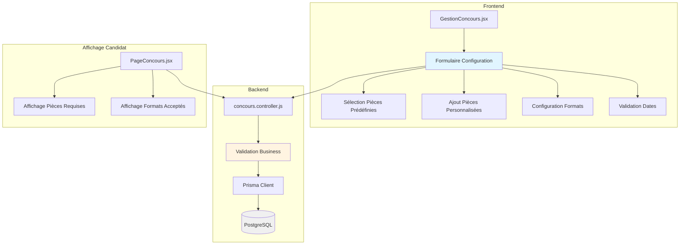

# Design Document: Configuration des Pièces du Dossier Candidat

## Overview

Cette fonctionnalité permet aux administrateurs DGES de configurer de manière flexible les pièces requises dans le dossier candidat lors de la création ou de la modification d'un concours. Le système offre une interface intuitive pour sélectionner des pièces prédéfinies, ajouter des pièces personnalisées avec leurs formats acceptés, définir les séries scolaires acceptées, et rendre obligatoires tous les champs de création incluant les dates importantes (dépôt et composition).

### Objectifs principaux

1. **Flexibilité documentaire**: Permettre à chaque concours d'avoir des exigences documentaires spécifiques
2. **Personnalisation**: Offrir la possibilité d'ajouter des pièces non prédéfinies avec leurs formats
3. **Validation robuste**: Garantir la cohérence des données (dates, formats, champs obligatoires)
4. **Expérience utilisateur**: Interface claire pour les administrateurs DGES et les candidats
5. **Traçabilité**: Maintenir l'historique des configurations pour audit

### Contexte technique

Le système UniPath utilise:
- **Backend**: Node.js/Express avec Prisma ORM et PostgreSQL
- **Frontend**: React avec Vite
- **Architecture**: API REST avec authentification JWT
- **Stockage**: Supabase Storage pour les fichiers

## Architecture

### Vue d'ensemble



### Flux de données

#### Création/Modification de concours (DGES)

1. **Initialisation**: L'administrateur DGES ouvre le formulaire de création/modification
2. **Configuration**: Sélection des pièces prédéfinies et ajout de pièces personnalisées
3. **Validation côté client**: Vérification des champs obligatoires et cohérence des dates
4. **Soumission**: Envoi des données au backend via API REST
5. **Validation côté serveur**: Vérification business rules et contraintes
6. **Persistance**: Sauvegarde dans PostgreSQL via Prisma
7. **Confirmation**: Retour à la liste des concours avec message de succès

#### Consultation par les candidats

1. **Récupération**: Le candidat consulte la liste des concours disponibles
2. **Filtrage**: Application du filtre par série scolaire si définie
3. **Affichage détails**: Consultation des pièces requises et formats acceptés
4. **Soumission dossier**: Upload des pièces selon la configuration du concours

### Composants principaux

#### Frontend

- **GestionConcours.jsx**: Interface de gestion des concours pour DGES
  - Formulaire de création/modification avec configuration des pièces
  - Validation des champs obligatoires
  - Gestion des pièces personnalisées
  
- **PageConcours.jsx**: Liste des concours pour les candidats
  - Affichage des concours filtrés par série
  - Consultation des détails et pièces requises

#### Backend

- **concours.controller.js**: Contrôleur principal
  - `createConcours()`: Création avec validation complète
  - `updateConcours()`: Modification avec vérification des inscriptions existantes
  - `getAllConcours()`: Récupération avec filtrage par série candidat

- **Middleware d'authentification**: Protection des routes DGES

## Components and Interfaces

### Modèle de données étendu

#### Structure de configuration des pièces

```typescript
interface PieceConfiguration {
  nom: string;                    // Nom de la pièce (ex: "Acte de naissance")
  obligatoire: boolean;           // Si la pièce est obligatoire
  formats: string[];              // Formats acceptés (ex: ["PDF", "JPEG"])
  predefined: boolean;            // Si c'est une pièce prédéfinie ou personnalisée
  description?: string;           // Description optionnelle
}

interface ConcoursConfiguration {
  piecesRequises: PieceConfiguration[];  // Liste des pièces configurées
  seriesAcceptees: string[];             // Séries scolaires acceptées
  dateDebutDepot: Date;                  // Date début dépôt dossier
  dateFinDepot: Date;                    // Date fin dépôt dossier
  dateDebutComposition: Date;            // Date début composition
  dateFinComposition: Date;              // Date fin composition
}
```

### API Endpoints

#### POST /api/concours
Création d'un nouveau concours avec configuration des pièces

**Request Body:**
```json
{
  "libelle": "Concours ENS 2026",
  "etablissement": "EPAC - Université d'Abomey-Calavi",
  "dateDebut": "2026-01-15",
  "dateFin": "2026-02-28",
  "dateComposition": "2026-03-15",
  "description": "Concours d'entrée à l'ENS",
  "fraisParticipation": 5000,
  "seriesAcceptees": ["C", "D"],
  "piecesRequises": [
    {
      "nom": "Acte de naissance",
      "obligatoire": true,
      "formats": ["PDF"],
      "predefined": true
    },
    {
      "nom": "Certificat médical",
      "obligatoire": true,
      "formats": ["PDF", "JPEG"],
      "predefined": false
    }
  ],
  "dateDebutDepot": "2026-01-15",
  "dateFinDepot": "2026-02-28",
  "dateDebutComposition": "2026-03-15",
  "dateFinComposition": "2026-03-20"
}
```

**Response (201):**
```json
{
  "id": "uuid",
  "libelle": "Concours ENS 2026",
  "piecesRequises": [...],
  "createdAt": "2026-01-01T00:00:00.000Z"
}
```

**Validation Errors (400):**
```json
{
  "error": "La date de fin de dépôt doit être postérieure à la date de début de dépôt"
}
```

#### PUT /api/concours/:id
Modification d'un concours existant

**Request Body:** Même structure que POST

**Response (200):** Concours mis à jour

**Warnings:** Si des inscriptions existent, un avertissement est retourné

#### GET /api/concours
Récupération de tous les concours (avec filtrage par série pour candidats authentifiés)

**Response (200):**
```json
[
  {
    "id": "uuid",
    "libelle": "Concours ENS 2026",
    "piecesRequises": [...],
    "seriesAcceptees": ["C", "D"],
    "dateDebutDepot": "2026-01-15",
    "dateFinDepot": "2026-02-28"
  }
]
```

#### GET /api/concours/:id
Récupération des détails d'un concours spécifique

**Response (200):** Détails complets incluant la configuration des pièces

### Interfaces React

#### Composant de configuration des pièces

```jsx
<PiecesConfiguration
  piecesRequises={formData.piecesRequises}
  onChange={(pieces) => setFormData({...formData, piecesRequises: pieces})}
  onAddCustomPiece={(piece) => handleAddCustomPiece(piece)}
  onRemovePiece={(index) => handleRemovePiece(index)}
/>
```

#### Composant d'ajout de pièce personnalisée

```jsx
<CustomPieceModal
  isOpen={showCustomPieceModal}
  onClose={() => setShowCustomPieceModal(false)}
  onSubmit={(piece) => handleCustomPieceSubmit(piece)}
/>
```

## Data Models

### Extension du modèle Prisma

Le modèle `Concours` existant sera étendu pour supporter la configuration des pièces:

```prisma
model Concours {
  id                    String        @id @default(uuid())
  libelle               String
  etablissement         String?
  dateDebut             DateTime
  dateFin               DateTime
  dateComposition       DateTime?
  description           String?
  fraisParticipation    Int?
  seriesAcceptees       String[]      @default([])
  
  // NOUVEAUX CHAMPS
  piecesRequises        Json?         // Configuration des pièces en JSON
  dateDebutDepot        DateTime?     // Date début dépôt dossier
  dateFinDepot          DateTime?     // Date fin dépôt dossier
  dateDebutComposition  DateTime?     // Date début composition
  dateFinComposition    DateTime?     // Date fin composition
  
  createdAt             DateTime      @default(now())
  inscriptions          Inscription[]
}
```

### Structure JSON pour piecesRequises

```json
{
  "pieces": [
    {
      "id": "acte-naissance",
      "nom": "Acte de naissance",
      "obligatoire": true,
      "formats": ["PDF"],
      "predefined": true,
      "description": "Acte de naissance original ou copie certifiée"
    },
    {
      "id": "carte-identite",
      "nom": "Carte d'identité",
      "obligatoire": true,
      "formats": ["PDF", "JPEG", "PNG"],
      "predefined": true
    },
    {
      "id": "quittance",
      "nom": "Quittance de paiement",
      "obligatoire": true,
      "formats": ["PDF"],
      "predefined": true,
      "description": "Reçu de paiement des frais de participation"
    },
    {
      "id": "custom-certificat-medical",
      "nom": "Certificat médical",
      "obligatoire": true,
      "formats": ["PDF", "JPEG"],
      "predefined": false,
      "description": "Certificat médical de moins de 3 mois"
    }
  ]
}
```

### Pièces prédéfinies

Liste des pièces prédéfinies disponibles dans le système:

```javascript
const PIECES_PREDEFINIES = [
  {
    id: 'acte-naissance',
    nom: 'Acte de naissance',
    formatsDefaut: ['PDF'],
    description: 'Acte de naissance original ou copie certifiée'
  },
  {
    id: 'carte-identite',
    nom: "Carte d'identité",
    formatsDefaut: ['PDF', 'JPEG', 'PNG'],
    description: "Carte d'identité nationale valide"
  },
  {
    id: 'photo',
    nom: "Photo d'identité",
    formatsDefaut: ['JPEG', 'PNG'],
    description: 'Photo récente format identité'
  },
  {
    id: 'releve-notes',
    nom: 'Relevé de notes Bac',
    formatsDefaut: ['PDF'],
    description: 'Relevé de notes du baccalauréat'
  },
  {
    id: 'quittance',
    nom: 'Quittance de paiement',
    formatsDefaut: ['PDF'],
    description: 'Reçu de paiement des frais de participation',
    obligatoire: true  // Toujours obligatoire
  }
];
```

### Formats de fichiers acceptés

```javascript
const FORMATS_DISPONIBLES = [
  { value: 'PDF', label: 'PDF', mimeType: 'application/pdf' },
  { value: 'JPEG', label: 'JPEG', mimeType: 'image/jpeg' },
  { value: 'PNG', label: 'PNG', mimeType: 'image/png' },
  { value: 'DOC', label: 'DOC', mimeType: 'application/msword' },
  { value: 'DOCX', label: 'DOCX', mimeType: 'application/vnd.openxmlformats-officedocument.wordprocessingml.document' }
];
```

## Error Handling

### Validation côté client

```javascript
function validateConcoursForm(formData) {
  const errors = {};
  
  // Champs obligatoires
  if (!formData.libelle) errors.libelle = 'Le libellé est obligatoire';
  if (!formData.etablissement) errors.etablissement = "L'établissement est obligatoire";
  if (!formData.dateDebutDepot) errors.dateDebutDepot = 'La date de début de dépôt est obligatoire';
  if (!formData.dateFinDepot) errors.dateFinDepot = 'La date de fin de dépôt est obligatoire';
  if (!formData.dateDebutComposition) errors.dateDebutComposition = 'La date de début de composition est obligatoire';
  if (!formData.dateFinComposition) errors.dateFinComposition = 'La date de fin de composition est obligatoire';
  if (!formData.fraisParticipation) errors.fraisParticipation = 'Les frais de participation sont obligatoires';
  if (!formData.seriesAcceptees || formData.seriesAcceptees.length === 0) {
    errors.seriesAcceptees = 'Au moins une série doit être sélectionnée';
  }
  
  // Validation des dates de dépôt
  if (formData.dateDebutDepot && formData.dateFinDepot) {
    const debut = new Date(formData.dateDebutDepot);
    const fin = new Date(formData.dateFinDepot);
    if (fin <= debut) {
      errors.dateFinDepot = 'La date de fin de dépôt doit être postérieure à la date de début';
    }
  }
  
  // Validation des dates de composition
  if (formData.dateDebutComposition && formData.dateFinComposition) {
    const debut = new Date(formData.dateDebutComposition);
    const fin = new Date(formData.dateFinComposition);
    if (fin <= debut) {
      errors.dateFinComposition = 'La date de fin de composition doit être postérieure à la date de début';
    }
  }
  
  // Validation cohérence dépôt/composition
  if (formData.dateFinDepot && formData.dateDebutComposition) {
    const finDepot = new Date(formData.dateFinDepot);
    const debutCompo = new Date(formData.dateDebutComposition);
    if (debutCompo <= finDepot) {
      errors.dateDebutComposition = 'La date de début de composition doit être postérieure à la date de fin de dépôt';
    }
  }
  
  // Validation des pièces
  if (!formData.piecesRequises || formData.piecesRequises.length === 0) {
    errors.piecesRequises = 'Au moins une pièce doit être sélectionnée';
  }
  
  // Vérifier que la quittance est présente
  const hasQuittance = formData.piecesRequises?.some(p => p.id === 'quittance');
  if (!hasQuittance) {
    errors.piecesRequises = 'La quittance de paiement est obligatoire';
  }
  
  return errors;
}
```

### Gestion des erreurs côté serveur

```javascript
// Dans concours.controller.js

exports.createConcours = async (req, res) => {
  try {
    const {
      libelle,
      etablissement,
      dateDebut,
      dateFin,
      dateComposition,
      description,
      fraisParticipation,
      seriesAcceptees,
      piecesRequises,
      dateDebutDepot,
      dateFinDepot,
      dateDebutComposition,
      dateFinComposition
    } = req.body;

    // Validation des champs obligatoires
    if (!libelle || !etablissement || !dateDebutDepot || !dateFinDepot || 
        !dateDebutComposition || !dateFinComposition || !fraisParticipation) {
      return res.status(400).json({
        error: 'Tous les champs obligatoires doivent être renseignés',
        details: {
          libelle: !libelle,
          etablissement: !etablissement,
          dateDebutDepot: !dateDebutDepot,
          dateFinDepot: !dateFinDepot,
          dateDebutComposition: !dateDebutComposition,
          dateFinComposition: !dateFinComposition,
          fraisParticipation: !fraisParticipation
        }
      });
    }

    // Validation des dates de dépôt
    const debutDepot = new Date(dateDebutDepot);
    const finDepot = new Date(dateFinDepot);
    if (finDepot <= debutDepot) {
      return res.status(400).json({
        error: 'La date de fin de dépôt doit être postérieure à la date de début de dépôt'
      });
    }

    // Validation des dates de composition
    const debutCompo = new Date(dateDebutComposition);
    const finCompo = new Date(dateFinComposition);
    if (finCompo <= debutCompo) {
      return res.status(400).json({
        error: 'La date de fin de composition doit être postérieure à la date de début de composition'
      });
    }

    // Validation cohérence dépôt/composition
    if (debutCompo <= finDepot) {
      return res.status(400).json({
        error: 'La date de début de composition doit être postérieure à la date de fin de dépôt'
      });
    }

    // Validation des séries
    if (!seriesAcceptees || seriesAcceptees.length === 0) {
      return res.status(400).json({
        error: 'Au moins une série doit être sélectionnée'
      });
    }

    const seriesValides = ['A', 'B', 'C', 'D', 'E', 'F1', 'F2', 'F3', 'F4', 'G'];
    const seriesInvalides = seriesAcceptees.filter(s => !seriesValides.includes(s));
    if (seriesInvalides.length > 0) {
      return res.status(400).json({
        error: `Séries invalides : ${seriesInvalides.join(', ')}`,
        seriesValides
      });
    }

    // Validation des pièces requises
    if (!piecesRequises || !Array.isArray(piecesRequises) || piecesRequises.length === 0) {
      return res.status(400).json({
        error: 'Au moins une pièce doit être configurée'
      });
    }

    // Vérifier que la quittance est présente
    const hasQuittance = piecesRequises.some(p => p.id === 'quittance');
    if (!hasQuittance) {
      return res.status(400).json({
        error: 'La quittance de paiement est obligatoire'
      });
    }

    // Validation des formats pour chaque pièce
    const formatsValides = ['PDF', 'JPEG', 'PNG', 'DOC', 'DOCX'];
    for (const piece of piecesRequises) {
      if (!piece.formats || piece.formats.length === 0) {
        return res.status(400).json({
          error: `La pièce "${piece.nom}" doit avoir au moins un format accepté`
        });
      }
      const formatsInvalides = piece.formats.filter(f => !formatsValides.includes(f));
      if (formatsInvalides.length > 0) {
        return res.status(400).json({
          error: `Formats invalides pour "${piece.nom}" : ${formatsInvalides.join(', ')}`,
          formatsValides
        });
      }
    }

    // Création du concours
    const concours = await prisma.concours.create({
      data: {
        libelle,
        etablissement,
        dateDebut: debutDepot,
        dateFin: finDepot,
        dateComposition: debutCompo,
        description: description || null,
        fraisParticipation: parseInt(fraisParticipation),
        seriesAcceptees,
        piecesRequises: { pieces: piecesRequises },
        dateDebutDepot: debutDepot,
        dateFinDepot: finDepot,
        dateDebutComposition: debutCompo,
        dateFinComposition: finCompo
      },
    });

    res.status(201).json(concours);
  } catch (error) {
    console.error('Erreur création concours:', error);
    res.status(500).json({ error: 'Erreur serveur lors de la création du concours' });
  }
};
```

### Messages d'erreur utilisateur

```javascript
const ERROR_MESSAGES = {
  REQUIRED_FIELD: 'Ce champ est obligatoire',
  INVALID_DATE_RANGE: 'La date de fin doit être postérieure à la date de début',
  INVALID_COMPOSITION_DATE: 'La composition doit avoir lieu après la fin du dépôt des dossiers',
  NO_SERIES_SELECTED: 'Veuillez sélectionner au moins une série',
  NO_PIECES_SELECTED: 'Veuillez sélectionner au moins une pièce',
  QUITTANCE_REQUIRED: 'La quittance de paiement est obligatoire',
  INVALID_FORMAT: 'Format de fichier invalide',
  MODIFICATION_WARNING: 'Attention : Ce concours a déjà des inscriptions. La modification des pièces requises peut affecter les candidats existants.',
  DELETE_WITH_INSCRIPTIONS: 'Impossible de supprimer ce concours car des inscriptions existent'
};
```

## Testing Strategy

Cette fonctionnalité implique principalement de la configuration et de la validation de données, avec des interactions UI complexes. La stratégie de test se concentrera sur les tests unitaires et d'intégration plutôt que sur les tests basés sur les propriétés (PBT).

### Tests unitaires

#### Backend (Node.js/Jest)

**Validation des dates:**
- Test: Date de fin de dépôt antérieure à date de début → erreur
- Test: Date de fin de composition antérieure à date de début → erreur
- Test: Date de début de composition antérieure à date de fin de dépôt → erreur
- Test: Dates valides → succès

**Validation des séries:**
- Test: Aucune série sélectionnée → erreur
- Test: Série invalide (ex: "Z") → erreur
- Test: Séries valides (ex: ["C", "D"]) → succès

**Validation des pièces:**
- Test: Aucune pièce configurée → erreur
- Test: Quittance absente → erreur
- Test: Format invalide pour une pièce → erreur
- Test: Configuration valide avec pièces prédéfinies → succès
- Test: Configuration valide avec pièces personnalisées → succès

**Modification avec inscriptions existantes:**
- Test: Modification d'un concours sans inscription → succès
- Test: Modification d'un concours avec inscriptions → avertissement retourné
- Test: Suppression d'un concours avec inscriptions → erreur

#### Frontend (React/Vitest)

**Composant GestionConcours:**
- Test: Affichage du formulaire de création
- Test: Validation des champs obligatoires
- Test: Ajout d'une pièce personnalisée
- Test: Suppression d'une pièce personnalisée
- Test: Sélection/désélection de pièces prédéfinies
- Test: Sélection de formats pour une pièce
- Test: Validation des dates côté client

**Composant PageConcours:**
- Test: Affichage des pièces requises pour un concours
- Test: Affichage des formats acceptés
- Test: Filtrage des concours par série candidat

### Tests d'intégration

**Flux complet de création:**
1. Authentification DGES
2. Ouverture du formulaire de création
3. Remplissage de tous les champs obligatoires
4. Configuration des pièces (prédéfinies + personnalisées)
5. Soumission du formulaire
6. Vérification de la création en base de données
7. Vérification de l'affichage dans la liste

**Flux complet de modification:**
1. Authentification DGES
2. Sélection d'un concours existant
3. Modification de la configuration des pièces
4. Soumission des modifications
5. Vérification de la mise à jour en base de données

**Flux candidat:**
1. Authentification candidat
2. Consultation de la liste des concours
3. Vérification du filtrage par série
4. Consultation des détails d'un concours
5. Vérification de l'affichage des pièces requises et formats

### Tests manuels

**Interface utilisateur:**
- Ergonomie du formulaire de configuration
- Clarté des messages d'erreur
- Responsive design sur mobile/tablette
- Accessibilité (navigation clavier, lecteurs d'écran)

**Cas limites:**
- Ajout de nombreuses pièces personnalisées (>10)
- Noms de pièces très longs
- Sélection de tous les formats disponibles
- Modification d'un concours avec de nombreuses inscriptions

### Couverture de test

**Objectifs:**
- Couverture du code backend: >80%
- Couverture des composants React: >70%
- Tous les cas d'erreur de validation testés
- Tous les flux utilisateur principaux testés

**Outils:**
- Backend: Jest + Supertest
- Frontend: Vitest + React Testing Library
- Couverture: Istanbul/NYC
- E2E (optionnel): Playwright ou Cypress

### Stratégie de test par requirement

| Requirement | Type de test | Description |
|-------------|--------------|-------------|
| Req 1 | Unit + Integration | Configuration des pièces prédéfinies |
| Req 2 | Unit + Integration | Ajout de pièces personnalisées |
| Req 3 | Unit | Validation des formats de fichiers |
| Req 4 | Unit | Validation des champs obligatoires |
| Req 5 | Unit + Integration | Configuration des séries acceptées |
| Req 6 | Unit | Validation des dates de dépôt |
| Req 7 | Unit | Validation des dates de composition |
| Req 8 | Integration | Validation complète et sauvegarde |
| Req 9 | Integration | Modification avec avertissement |
| Req 10 | Integration | Affichage pour les candidats |

---

## Annexes

### Migration Prisma

```prisma
-- Migration pour ajouter les nouveaux champs au modèle Concours
-- AlterTable
ALTER TABLE "Concours" ADD COLUMN "piecesRequises" JSONB,
ADD COLUMN "dateDebutDepot" TIMESTAMP(3),
ADD COLUMN "dateFinDepot" TIMESTAMP(3),
ADD COLUMN "dateDebutComposition" TIMESTAMP(3),
ADD COLUMN "dateFinComposition" TIMESTAMP(3);
```

### Exemple de données de test

```javascript
const concoursTest = {
  libelle: 'Concours ENS 2026',
  etablissement: "EPAC - Université d'Abomey-Calavi",
  dateDebutDepot: '2026-01-15',
  dateFinDepot: '2026-02-28',
  dateDebutComposition: '2026-03-15',
  dateFinComposition: '2026-03-20',
  description: "Concours d'entrée à l'École Normale Supérieure",
  fraisParticipation: 5000,
  seriesAcceptees: ['C', 'D'],
  piecesRequises: {
    pieces: [
      {
        id: 'acte-naissance',
        nom: 'Acte de naissance',
        obligatoire: true,
        formats: ['PDF'],
        predefined: true
      },
      {
        id: 'carte-identite',
        nom: "Carte d'identité",
        obligatoire: true,
        formats: ['PDF', 'JPEG', 'PNG'],
        predefined: true
      },
      {
        id: 'quittance',
        nom: 'Quittance de paiement',
        obligatoire: true,
        formats: ['PDF'],
        predefined: true
      },
      {
        id: 'custom-certificat-medical',
        nom: 'Certificat médical',
        obligatoire: true,
        formats: ['PDF', 'JPEG'],
        predefined: false,
        description: 'Certificat médical de moins de 3 mois'
      }
    ]
  }
};
```

### Considérations de performance

- **Indexation**: Ajouter des index sur `dateDebutDepot`, `dateFinDepot` pour les requêtes de filtrage
- **Caching**: Mettre en cache la liste des concours côté frontend (invalidation lors de modifications)
- **Pagination**: Implémenter la pagination si le nombre de concours devient important (>100)
- **Optimisation JSON**: Utiliser JSONB dans PostgreSQL pour des requêtes efficaces sur `piecesRequises`

### Considérations de sécurité

- **Authentification**: Vérifier le rôle DGES pour toutes les opérations de création/modification
- **Validation**: Double validation (client + serveur) pour éviter les données malveillantes
- **Sanitization**: Nettoyer les entrées utilisateur (noms de pièces, descriptions)
- **Audit**: Logger toutes les modifications de configuration de concours
- **Rate limiting**: Limiter le nombre de requêtes de création/modification par utilisateur

### Évolutions futures possibles

1. **Templates de configuration**: Sauvegarder des configurations réutilisables
2. **Import/Export**: Importer/exporter des configurations de concours
3. **Historique**: Tracer l'historique des modifications de configuration
4. **Notifications**: Notifier les candidats inscrits en cas de modification des pièces requises
5. **Validation avancée**: Vérification automatique de la validité des documents uploadés
6. **Multi-langue**: Support de plusieurs langues pour les noms de pièces
