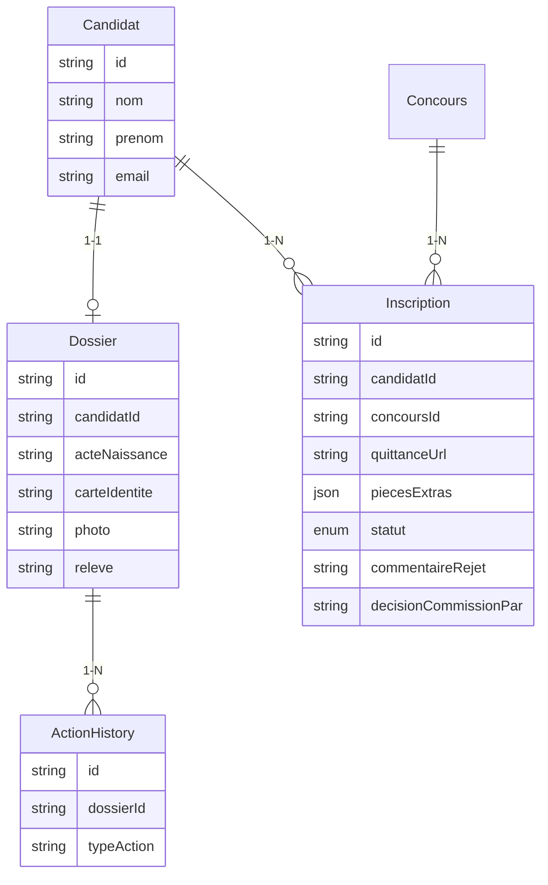
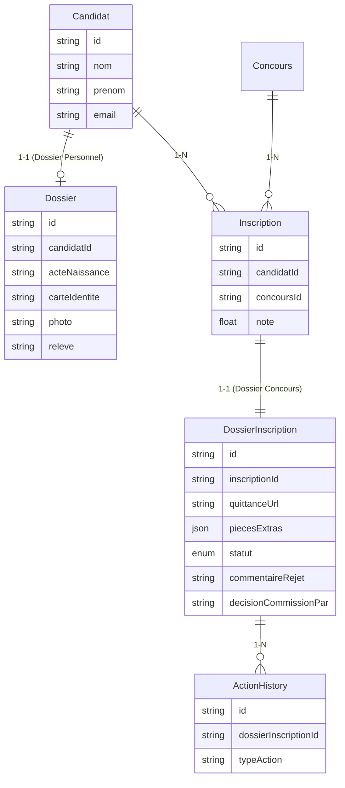
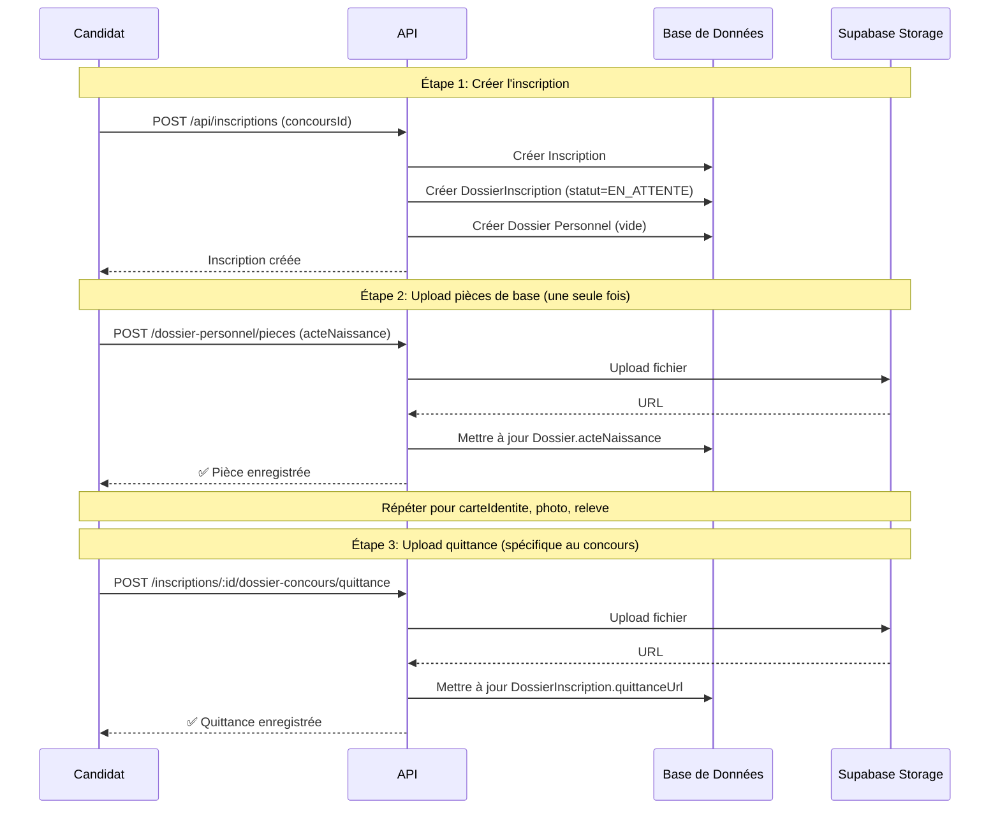
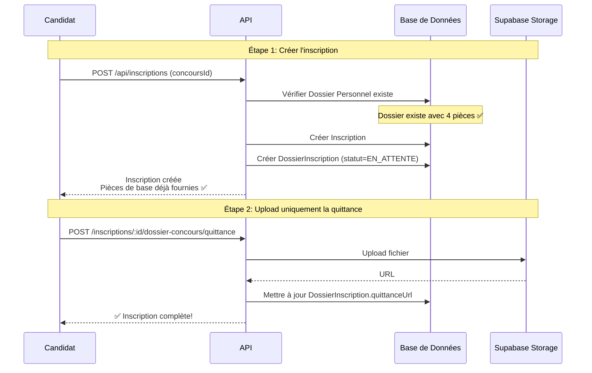
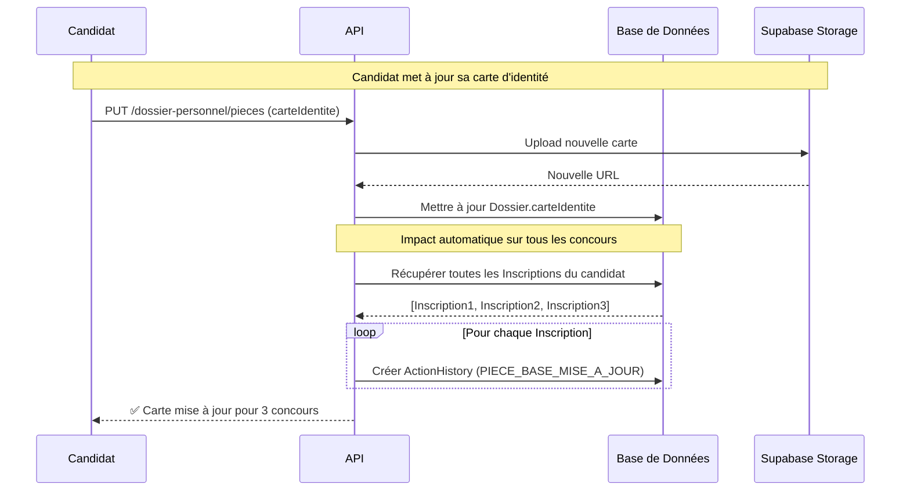

# Résumé Visuel - Refonte Dossier Candidat et Inscription

## Principe "Upload Once, Use Everywhere"

### Avant la Refonte ❌

```
Candidat inscrit à 3 concours
│
├─ Concours Médecine
│  └─ Upload: acteNaissance, carteIdentite, photo, releve, quittance
│
├─ Concours Pharmacie
│  └─ Upload: acteNaissance, carteIdentite, photo, releve, quittance (DUPLICATION!)
│
└─ Concours Odontologie
   └─ Upload: acteNaissance, carteIdentite, photo, releve, quittance (DUPLICATION!)

❌ Problèmes:
- 15 uploads au total (5 × 3)
- Duplication des fichiers
- Expérience utilisateur frustrante
- Stockage inefficace
```

### Après la Refonte ✅

```
Candidat inscrit à 3 concours
│
├─ Dossier Personnel (Upload Once)
│  └─ Upload: acteNaissance, carteIdentite, photo, releve (4 pièces)
│
├─ Concours Médecine (Use Everywhere)
│  └─ Upload: quittance uniquement
│
├─ Concours Pharmacie (Use Everywhere)
│  └─ Upload: quittance uniquement
│
└─ Concours Odontologie (Use Everywhere)
   └─ Upload: quittance uniquement

✅ Avantages:
- 7 uploads au total (4 + 1 + 1 + 1)
- Aucune duplication
- Expérience utilisateur optimale
- Stockage efficace
- Mise à jour centralisée
```

## Architecture Avant/Après

### Structure de Base de Données - AVANT



**❌ Problèmes** :
- `ActionHistory.dossierId` pointe vers `Dossier` (dossier personnel) au lieu du dossier d'inscription
- `Inscription` mélange les responsabilités (lien candidat-concours + pièces spécifiques + statut)
- Pas de séparation claire entre pièces de base et pièces spécifiques

### Structure de Base de Données - APRÈS



**✅ Avantages** :
- Séparation claire des responsabilités
- `ActionHistory` pointe correctement vers `DossierInscription`
- `Inscription` est simplifié (uniquement le lien candidat-concours)
- Nouvelle entité `DossierInscription` pour les pièces spécifiques + statut

## Flux de Données

### Flux 1 : Première Inscription



### Flux 2 : Inscription Suivante (Réutilisation)



### Flux 3 : Mise à Jour Pièce de Base (Impact Multi-Concours)



## Calcul de Complétude

### Formule

```
Pourcentage Global = (Pièces Présentes / Pièces Requises) × 100

Où:
- Pièces Présentes = piecesBasesPresentes + quittancePresente + piecesExtrasPresentes
- Pièces Requises = 4 (base) + 1 (quittance) + N (extras configurés)
```

### Exemple Visuel

```
Candidat inscrit au Concours Médecine 2024
│
├─ Pièces de Base (depuis Dossier Personnel)
│  ├─ ✅ acteNaissance (fournie)
│  ├─ ✅ carteIdentite (fournie)
│  ├─ ❌ photo (manquante)
│  └─ ✅ releve (fournie)
│  └─ Complétude: 3/4 = 75%
│
└─ Pièces Spécifiques (depuis Dossier Concours)
   ├─ ✅ quittance (fournie)
   ├─ ✅ diplome_bac (fournie)
   └─ ❌ lettre_motivation (manquante)
   └─ Complétude: 2/3 = 67%

Complétude Globale: 5/7 = 71%
```

## Vue Agrégée pour la Commission

```
┌─────────────────────────────────────────────────────────────┐
│ Dossier Complet - John DOE - Médecine 2024                 │
├─────────────────────────────────────────────────────────────┤
│                                                             │
│ 📁 PIÈCES DE BASE (Dossier Personnel)                      │
│ ├─ ✅ Acte de naissance        [Voir] [Télécharger]       │
│ ├─ ✅ Carte d'identité         [Voir] [Télécharger]       │
│ ├─ ✅ Photo d'identité         [Voir] [Télécharger]       │
│ └─ ✅ Relevé de notes          [Voir] [Télécharger]       │
│                                                             │
│ 📄 PIÈCES SPÉCIFIQUES (Dossier Concours)                   │
│ ├─ ✅ Quittance                [Voir] [Télécharger]       │
│ ├─ ✅ Diplôme du bac           [Voir] [Télécharger]       │
│ └─ ❌ Lettre de motivation     [À uploader]               │
│                                                             │
│ 📊 COMPLÉTUDE: 86% (6/7 pièces)                            │
│                                                             │
│ 📋 STATUT: EN_ATTENTE                                       │
│                                                             │
│ 💬 DÉCISIONS                                                │
│ └─ Aucune décision pour le moment                          │
│                                                             │
│ [Valider] [Rejeter] [Mettre sous réserve]                  │
└─────────────────────────────────────────────────────────────┘
```

## Comparaison des Responsabilités

### Table `Inscription`

| Champ | AVANT | APRÈS | Raison |
|-------|-------|-------|--------|
| `id` | ✅ | ✅ | Identifiant unique |
| `numeroInscription` | ✅ | ✅ | Numéro d'inscription |
| `candidatId` | ✅ | ✅ | Lien vers Candidat |
| `concoursId` | ✅ | ✅ | Lien vers Concours |
| `note` | ✅ | ✅ | Note obtenue |
| `statut` | ✅ | ❌ | Déplacé vers DossierInscription |
| `quittanceUrl` | ✅ | ❌ | Déplacé vers DossierInscription |
| `piecesExtras` | ✅ | ❌ | Déplacé vers DossierInscription |
| `commentaireRejet` | ✅ | ❌ | Déplacé vers DossierInscription |
| `decisionCommissionPar` | ✅ | ❌ | Déplacé vers DossierInscription |
| `createdAt` | ✅ | ✅ | Date de création |

**Responsabilité AVANT** : Lien candidat-concours + Pièces spécifiques + Statut + Décisions (trop de responsabilités!)

**Responsabilité APRÈS** : Uniquement le lien candidat-concours (principe de responsabilité unique)

### Table `DossierInscription` (Nouvelle)

| Champ | Description |
|-------|-------------|
| `id` | Identifiant unique |
| `inscriptionId` | Lien vers Inscription (1-1) |
| `quittanceUrl` | URL de la quittance (obligatoire) |
| `piecesExtras` | Pièces configurables par concours (JSON) |
| `statut` | État du dossier (enum) |
| `commentaireRejet` | Commentaire si rejet |
| `commentaireSousReserve` | Commentaire si sous réserve |
| `decisionCommissionPar` | ID du membre commission |
| `decisionCommissionDate` | Date de la décision |
| `decisionControleurPar` | ID du contrôleur |
| `decisionControleurDate` | Date de la décision |
| `commentaireControleur` | Commentaire du contrôleur |
| `createdAt` | Date de création |
| `updatedAt` | Date de mise à jour |

**Responsabilité** : Pièces spécifiques + Statut + Décisions pour une inscription donnée

## Endpoints API

### Nouveaux Endpoints

```
📁 Dossier Personnel
├─ GET    /api/candidats/:candidatId/dossier-personnel
└─ PUT    /api/candidats/:candidatId/dossier-personnel/pieces

📄 Dossier Concours
├─ GET    /api/inscriptions/:inscriptionId/dossier-complet
├─ POST   /api/inscriptions/:inscriptionId/dossier-concours/quittance
└─ POST   /api/inscriptions/:inscriptionId/dossier-concours/pieces-extras

📊 Complétude
└─ GET    /api/inscriptions/:inscriptionId/completion

📜 Historique
└─ GET    /api/dossiers-inscription/:dossierInscriptionId/historique
```

### Endpoints Modifiés

```
📝 Inscription
├─ POST   /api/inscriptions
│         → Crée automatiquement DossierInscription
│
├─ GET    /api/inscriptions/:id
│         → Inclut dossierInscription dans la réponse
│
└─ DELETE /api/inscriptions/:id
          → Supprime en cascade DossierInscription
```

## Bénéfices Mesurables

### Réduction des Uploads

```
Scénario: Candidat s'inscrit à 5 concours

AVANT:
- 4 pièces de base × 5 concours = 20 uploads
- 1 quittance × 5 concours = 5 uploads
- Total: 25 uploads

APRÈS:
- 4 pièces de base × 1 fois = 4 uploads
- 1 quittance × 5 concours = 5 uploads
- Total: 9 uploads

Réduction: 64% d'uploads en moins! 🎉
```

### Réduction du Stockage

```
Scénario: 1000 candidats, moyenne 3 concours par candidat

AVANT:
- 1000 candidats × 3 concours × 4 pièces = 12,000 fichiers
- Taille moyenne: 2 MB par fichier
- Total: 24 GB

APRÈS:
- 1000 candidats × 4 pièces = 4,000 fichiers
- Taille moyenne: 2 MB par fichier
- Total: 8 GB

Réduction: 67% de stockage en moins! 🎉
```

### Amélioration de l'Expérience Utilisateur

```
Temps moyen pour compléter une inscription:

AVANT:
- Upload 4 pièces de base: 10 minutes
- Upload quittance: 2 minutes
- Total par concours: 12 minutes
- Pour 3 concours: 36 minutes

APRÈS:
- Upload 4 pièces de base (une fois): 10 minutes
- Upload quittance (par concours): 2 minutes
- Total pour 3 concours: 16 minutes

Gain de temps: 56% plus rapide! 🎉
```

## Résumé des Changements

### ✅ Ce qui est ajouté

- Nouvelle table `DossierInscription`
- Nouveaux endpoints API pour dossier personnel et dossier complet
- Routage intelligent dans `dossier.controller.js`
- Calcul de complétude avec référence implicite
- Création automatique de `DossierInscription` lors de l'inscription
- Traçabilité des mises à jour de pièces de base (impact multi-concours)

### 🔄 Ce qui est modifié

- Table `Inscription` : suppression des champs déplacés vers `DossierInscription`
- Table `ActionHistory` : `dossierId` → `dossierInscriptionId`
- Contrôleurs : adaptation pour utiliser la nouvelle structure
- Calcul de complétude : utilisation de la référence implicite

### ❌ Ce qui est supprimé

- Aucune fonctionnalité n'est supprimée
- Toutes les données existantes sont migrées
- Compatibilité ascendante maintenue

