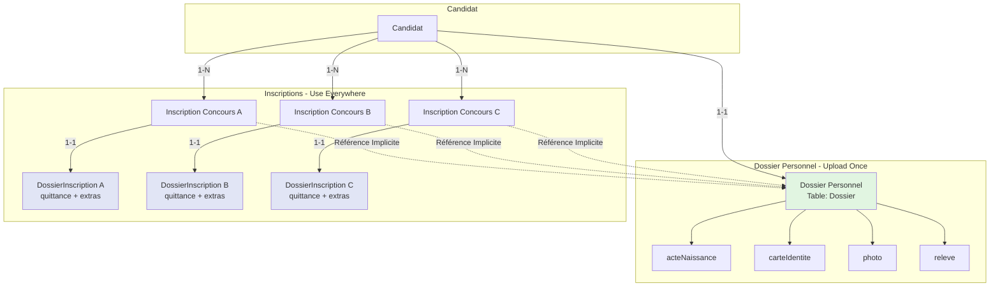
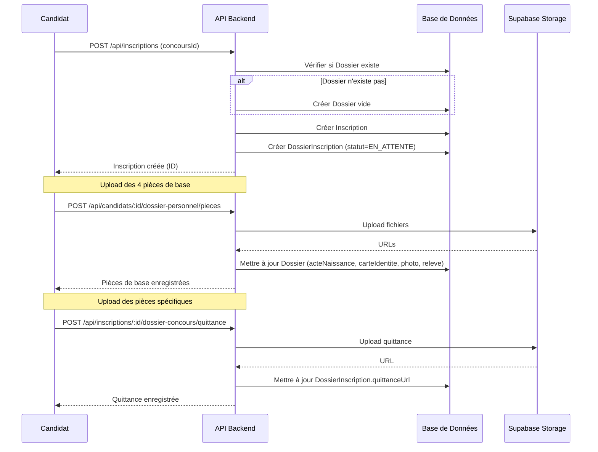
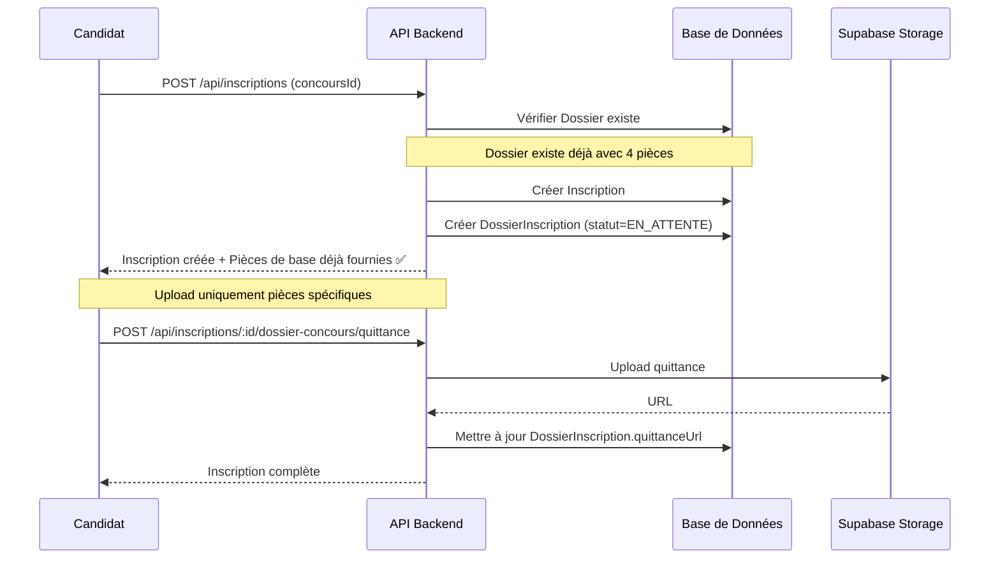
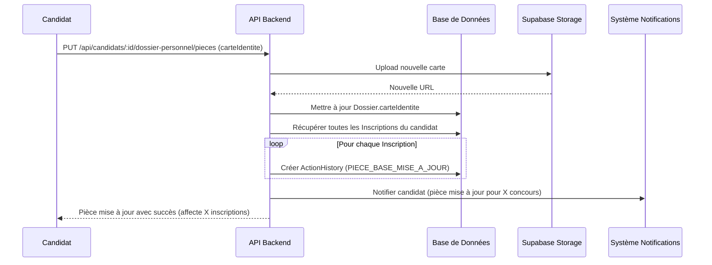
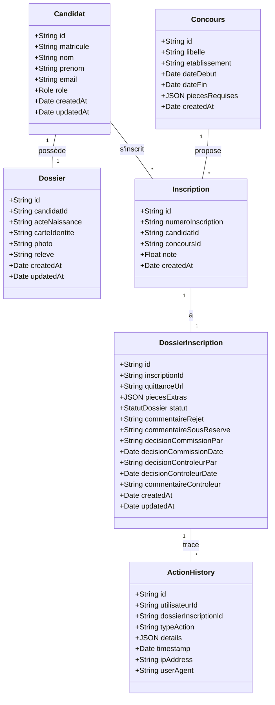

# Document de Design - Refonte Dossier Candidat et Inscription

## Overview

Cette refonte architecturale implémente le principe **"Upload Once, Use Everywhere"** pour optimiser l'expérience candidat et résoudre le conflit sémantique entre le Dossier Personnel du candidat et le Dossier Concours spécifique à chaque inscription.

### Principe Fondamental

Un candidat upload ses **4 pièces génériques** (acte de naissance, carte d'identité, photo, relevé de notes) **une seule fois** lors de son inscription sur la plateforme. Ces pièces sont stockées dans son **Dossier Personnel** (`Dossier`) et **automatiquement réutilisées** pour toutes ses inscriptions aux concours via une **référence implicite**.

Lors de chaque inscription à un concours, le candidat doit uniquement uploader les **pièces spécifiques** :
- **Quittance** (obligatoire)
- **Pièces extras** (configurables par concours)

### Objectifs

1. **Éliminer la duplication** : Les candidats n'uploadent plus les mêmes pièces pour chaque concours
2. **Clarifier les responsabilités** : Séparation nette entre Dossier Personnel (pièces de base) et Dossier Concours (pièces spécifiques + statut)
3. **Améliorer l'expérience** : Interface claire montrant quelles pièces sont déjà fournies vs à uploader
4. **Maintenir la traçabilité** : Historique des actions sur chaque dossier d'inscription
5. **Optimiser les performances** : Réduction du stockage et des uploads redondants

### Bénéfices

- **Pour les candidats** : Gain de temps, expérience simplifiée, mise à jour centralisée des pièces de base
- **Pour la commission** : Vue agrégée complète (pièces de base + spécifiques) en un seul endroit
- **Pour le système** : Réduction du stockage, cohérence des données, architecture plus maintenable


## Architecture

### Vue d'Ensemble du Système "Upload Once, Use Everywhere"



### Séparation des Responsabilités

#### Dossier Personnel (`Dossier`)
- **Responsabilité** : Stocker les 4 pièces justificatives génériques du candidat
- **Cardinalité** : 1-1 avec Candidat
- **Contenu** :
  - `acteNaissance` : URL du fichier
  - `carteIdentite` : URL du fichier
  - `photo` : URL du fichier
  - `releve` : URL du fichier
- **Cycle de vie** : Créé lors de la première inscription, mis à jour par le candidat
- **Impact des modifications** : Une mise à jour d'une pièce de base affecte automatiquement toutes les inscriptions

#### Dossier Concours (`DossierInscription`)
- **Responsabilité** : Stocker les pièces spécifiques à une inscription + statut + décisions
- **Cardinalité** : 1-1 avec Inscription
- **Contenu** :
  - `quittanceUrl` : URL de la quittance (obligatoire)
  - `piecesExtras` : JSON des pièces configurables par concours
  - `statut` : État du dossier (enum StatutDossier)
  - Champs de décision (commission, contrôleur)
  - Commentaires (rejet, sous réserve)
- **Cycle de vie** : Créé automatiquement lors de la création d'une inscription
- **Impact des modifications** : Modifications isolées à cette inscription uniquement

#### Inscription
- **Responsabilité** : Lien entre Candidat et Concours
- **Cardinalité** : N-N (un candidat peut s'inscrire à plusieurs concours)
- **Contenu** :
  - `id`, `numeroInscription`
  - `candidatId`, `concoursId`
  - `note` (résultat du concours)
  - `createdAt`
- **Rôle** : Point de jonction permettant la référence implicite vers le Dossier Personnel

### Mécanisme de Référence Implicite

Le système accède aux pièces de base via le chemin :
```
Inscription → Candidat → Dossier Personnel
```

**Exemple de requête Prisma** :
```javascript
const inscription = await prisma.inscription.findUnique({
  where: { id: inscriptionId },
  include: {
    candidat: {
      include: {
        dossier: true  // Accès aux 4 pièces de base
      }
    },
    dossierInscription: true  // Accès aux pièces spécifiques
  }
});

// Accès aux pièces de base
const piecesBase = inscription.candidat.dossier;
// Accès aux pièces spécifiques
const piecesSpecifiques = inscription.dossierInscription;
```

### Flux de Données

#### Flux 1 : Première Inscription d'un Candidat



#### Flux 2 : Inscription Suivante (Réutilisation)



#### Flux 3 : Mise à Jour d'une Pièce de Base (Impact Multi-Concours)



### Calcul de Complétude avec Référence Implicite

Le calcul de complétude agrège les pièces de base (depuis Dossier Personnel) et les pièces spécifiques (depuis Dossier Concours).

**Formule** :
```
Pourcentage = (piecesBasesPresentes + quittancePresente + piecesExtrasPresentes) / (4 + 1 + nombrePiecesExtrasRequises) * 100
```

**Algorithme** :
```javascript
async function calculerCompletude(inscriptionId) {
  // 1. Récupérer l'inscription avec référence implicite
  const inscription = await prisma.inscription.findUnique({
    where: { id: inscriptionId },
    include: {
      candidat: { include: { dossier: true } },
      dossierInscription: true,
      concours: { select: { piecesRequises: true } }
    }
  });
  
  // 2. Vérifier les 4 pièces de base (depuis Dossier Personnel)
  const dossier = inscription.candidat.dossier;
  const piecesBase = ['acteNaissance', 'carteIdentite', 'photo', 'releve'];
  const piecesBasesPresentes = dossier 
    ? piecesBase.filter(p => dossier[p]).length 
    : 0;
  
  // 3. Vérifier la quittance (depuis Dossier Concours)
  const quittancePresente = inscription.dossierInscription?.quittanceUrl ? 1 : 0;
  
  // 4. Vérifier les pièces extras (depuis Dossier Concours)
  const piecesExtrasConfig = inscription.concours.piecesRequises?.extras || [];
  const piecesExtrasPresentes = piecesExtrasConfig.filter(
    p => inscription.dossierInscription?.piecesExtras?.[p.nom]
  ).length;
  
  // 5. Calculer le pourcentage
  const total = 4 + 1 + piecesExtrasConfig.length;
  const presentes = piecesBasesPresentes + quittancePresente + piecesExtrasPresentes;
  const pourcentage = Math.round((presentes / total) * 100);
  
  return {
    pourcentage,
    piecesBase: piecesBase.map(p => ({
      nom: p,
      statut: dossier?.[p] ? 'fournie' : 'manquante',
      source: 'dossier_personnel',
      url: dossier?.[p]
    })),
    piecesSpecifiques: [
      {
        nom: 'quittance',
        statut: quittancePresente ? 'fournie' : 'manquante',
        source: 'dossier_concours',
        url: inscription.dossierInscription?.quittanceUrl
      },
      ...piecesExtrasConfig.map(p => ({
        nom: p.nom,
        statut: inscription.dossierInscription?.piecesExtras?.[p.nom] ? 'fournie' : 'manquante',
        source: 'dossier_concours',
        url: inscription.dossierInscription?.piecesExtras?.[p.nom]
      }))
    ]
  };
}
```


## Components and Interfaces

### Schéma Prisma Détaillé

#### Modifications de la Table `Inscription`

**AVANT (État Actuel)** :
```prisma
model Inscription {
  id String @id @default(uuid())
  numeroInscription String? @unique
  candidatId String
  concoursId String
  statut StatutDossier @default(EN_ATTENTE)  // ❌ À déplacer
  quittanceUrl String?  // ❌ À déplacer
  piecesExtras Json?  // ❌ À déplacer
  
  // Décisions
  commentaireRejet String?  // ❌ À déplacer
  commentaireSousReserve String?  // ❌ À déplacer
  decisionCommissionPar String?  // ❌ À déplacer
  decisionCommissionDate DateTime?  // ❌ À déplacer
  decisionControleurPar String?  // ❌ À déplacer
  decisionControleurDate DateTime?  // ❌ À déplacer
  commentaireControleur String?  // ❌ À déplacer
  
  note Float?
  createdAt DateTime @default(now())
  candidat Candidat @relation(fields: [candidatId], references: [id])
  concours Concours @relation(fields: [concoursId], references: [id])
  @@unique([candidatId, concoursId])
}
```

**APRÈS (Nouvelle Structure)** :
```prisma
model Inscription {
  id String @id @default(uuid())
  numeroInscription String? @unique
  candidatId String
  concoursId String
  note Float?  // Note obtenue au concours
  createdAt DateTime @default(now())
  
  // Relations
  candidat Candidat @relation(fields: [candidatId], references: [id])
  concours Concours @relation(fields: [concoursId], references: [id])
  dossierInscription DossierInscription?  // ✅ Nouvelle relation 1-1
  
  @@unique([candidatId, concoursId])
  @@index([candidatId])
  @@index([concoursId])
}
```

#### Création de la Table `DossierInscription`

```prisma
model DossierInscription {
  id String @id @default(uuid())
  inscriptionId String @unique  // Relation 1-1 avec Inscription
  
  // Pièces spécifiques au concours
  quittanceUrl String?  // URL de la quittance (obligatoire pour validation)
  piecesExtras Json?  // Pièces configurables par concours { "diplome": "url", "cv": "url" }
  
  // Statut et workflow
  statut StatutDossier @default(EN_ATTENTE)
  
  // Décision de la commission
  commentaireRejet String?  // Commentaire si rejet
  commentaireSousReserve String?  // Commentaire si sous réserve
  decisionCommissionPar String?  // ID du membre commission
  decisionCommissionDate DateTime?  // Date de la décision
  
  // Décision du contrôleur
  decisionControleurPar String?  // ID du contrôleur
  decisionControleurDate DateTime?  // Date de la décision
  commentaireControleur String?  // Commentaire du contrôleur
  
  // Timestamps
  createdAt DateTime @default(now())
  updatedAt DateTime @updatedAt
  
  // Relations
  inscription Inscription @relation(fields: [inscriptionId], references: [id], onDelete: Cascade)
  actionHistory ActionHistory[]  // Historique des actions sur ce dossier
  
  @@index([inscriptionId])
  @@index([statut])
  @@index([createdAt])
}
```

#### Modification de la Table `ActionHistory`

**AVANT** :
```prisma
model ActionHistory {
  id String @id @default(uuid())
  utilisateurId String
  dossierId String  // ❌ Référence incorrecte (pointe vers Dossier au lieu de DossierInscription)
  typeAction String
  details Json?
  timestamp DateTime @default(now())
  ipAddress String?
  userAgent String?
  createdAt DateTime @default(now())
  updatedAt DateTime @updatedAt

  @@index([dossierId])
  @@index([utilisateurId])
  @@index([timestamp])
  @@index([typeAction])
  @@index([dossierId, timestamp(sort: Desc)])
  @@index([utilisateurId, timestamp(sort: Desc)])
}
```

**APRÈS** :
```prisma
model ActionHistory {
  id String @id @default(uuid())
  utilisateurId String
  dossierInscriptionId String  // ✅ Référence correcte vers DossierInscription
  typeAction String
  details Json?
  timestamp DateTime @default(now())
  ipAddress String?
  userAgent String?
  createdAt DateTime @default(now())
  updatedAt DateTime @updatedAt
  
  // Relation
  dossierInscription DossierInscription @relation(fields: [dossierInscriptionId], references: [id], onDelete: Cascade)

  @@index([dossierInscriptionId])
  @@index([utilisateurId])
  @@index([timestamp])
  @@index([typeAction])
  @@index([dossierInscriptionId, timestamp(sort: Desc)])
  @@index([utilisateurId, timestamp(sort: Desc)])
}
```

#### Table `Dossier` (Inchangée)

```prisma
model Dossier {
  id String @id @default(uuid())
  candidatId String @unique
  
  // 4 pièces de base (uploadées une seule fois)
  acteNaissance String?
  carteIdentite String?
  photo String?
  releve String?
  
  createdAt DateTime @default(now())
  updatedAt DateTime @updatedAt
  
  candidat Candidat @relation(fields: [candidatId], references: [id])
  
  @@index([candidatId])
}
```

### Diagramme de Structure de Base de Données

```mermaid
erDiagram
    Candidat ||--o| Dossier : "1-1 (Dossier Personnel)"
    Candidat ||--o{ Inscription : "1-N"
    Concours ||--o{ Inscription : "1-N"
    Inscription ||--|| DossierInscription : "1-1 (Dossier Concours)"
    DossierInscription ||--o{ ActionHistory : "1-N"
    
    Candidat {
        string id PK
        string matricule UK
        string nom
        string prenom
        string email UK
        string role
    }
    
    Dossier {
        string id PK
        string candidatId FK_UK
        string acteNaissance
        string carteIdentite
        string photo
        string releve
        datetime createdAt
        datetime updatedAt
    }
    
    Inscription {
        string id PK
        string numeroInscription UK
        string candidatId FK
        string concoursId FK
        float note
        datetime createdAt
    }
    
    DossierInscription {
        string id PK
        string inscriptionId FK_UK
        string quittanceUrl
        json piecesExtras
        enum statut
        string commentaireRejet
        string commentaireSousReserve
        string decisionCommissionPar
        datetime decisionCommissionDate
        string decisionControleurPar
        datetime decisionControleurDate
        string commentaireControleur
        datetime createdAt
        datetime updatedAt
    }
    
    ActionHistory {
        string id PK
        string utilisateurId
        string dossierInscriptionId FK
        string typeAction
        json details
        datetime timestamp
        string ipAddress
        string userAgent
    }
    
    Concours {
        string id PK
        string libelle
        datetime dateDebut
        datetime dateFin
        json piecesRequises
    }
```

### Endpoints API

#### Groupe 1 : Gestion du Dossier Personnel

##### GET `/api/candidats/:candidatId/dossier-personnel`
**Description** : Récupérer le dossier personnel du candidat avec les 4 pièces de base

**Permissions** : CANDIDAT (soi-même), COMMISSION, CONTROLEUR, DGES

**Réponse** :
```json
{
  "id": "uuid",
  "candidatId": "uuid",
  "piecesBase": {
    "acteNaissance": {
      "url": "https://...",
      "uploadedAt": "2024-01-15T10:30:00Z",
      "statut": "fournie"
    },
    "carteIdentite": {
      "url": "https://...",
      "uploadedAt": "2024-01-15T10:32:00Z",
      "statut": "fournie"
    },
    "photo": {
      "url": null,
      "uploadedAt": null,
      "statut": "manquante"
    },
    "releve": {
      "url": "https://...",
      "uploadedAt": "2024-01-15T10:35:00Z",
      "statut": "fournie"
    }
  },
  "completude": {
    "pourcentage": 75,
    "piecesPresentes": 3,
    "piecesRequises": 4
  },
  "impactInscriptions": 3,  // Nombre d'inscriptions utilisant ces pièces
  "createdAt": "2024-01-15T10:30:00Z",
  "updatedAt": "2024-01-15T10:35:00Z"
}
```

##### PUT `/api/candidats/:candidatId/dossier-personnel/pieces`
**Description** : Mettre à jour une ou plusieurs pièces de base (impact multi-concours)

**Permissions** : CANDIDAT (soi-même uniquement)

**Body** :
```json
{
  "typePiece": "carteIdentite",  // acteNaissance | carteIdentite | photo | releve
  "fichier": "multipart/form-data"
}
```

**Réponse** :
```json
{
  "message": "Pièce mise à jour avec succès",
  "piece": {
    "type": "carteIdentite",
    "url": "https://...",
    "uploadedAt": "2024-01-20T14:00:00Z"
  },
  "impactInscriptions": 3,
  "inscriptionsAffectees": [
    { "id": "uuid1", "concours": "Médecine 2024" },
    { "id": "uuid2", "concours": "Pharmacie 2024" },
    { "id": "uuid3", "concours": "Odontologie 2024" }
  ]
}
```

#### Groupe 2 : Gestion du Dossier Concours

##### GET `/api/inscriptions/:inscriptionId/dossier-complet`
**Description** : Récupérer la vue agrégée (pièces de base + pièces spécifiques + statut)

**Permissions** : CANDIDAT (propriétaire), COMMISSION, CONTROLEUR, DGES

**Réponse** :
```json
{
  "inscription": {
    "id": "uuid",
    "numeroInscription": "UAC-2024-MED-00123",
    "candidat": {
      "id": "uuid",
      "nom": "DOE",
      "prenom": "John",
      "email": "john.doe@example.com"
    },
    "concours": {
      "id": "uuid",
      "libelle": "Concours Médecine 2024",
      "etablissement": "Faculté de Médecine"
    }
  },
  "piecesBase": {
    "source": "dossier_personnel",
    "pieces": [
      {
        "nom": "acteNaissance",
        "url": "https://...",
        "statut": "fournie",
        "uploadedAt": "2024-01-15T10:30:00Z"
      },
      {
        "nom": "carteIdentite",
        "url": "https://...",
        "statut": "fournie",
        "uploadedAt": "2024-01-15T10:32:00Z"
      },
      {
        "nom": "photo",
        "url": null,
        "statut": "manquante",
        "uploadedAt": null
      },
      {
        "nom": "releve",
        "url": "https://...",
        "statut": "fournie",
        "uploadedAt": "2024-01-15T10:35:00Z"
      }
    ]
  },
  "piecesSpecifiques": {
    "source": "dossier_concours",
    "pieces": [
      {
        "nom": "quittance",
        "url": "https://...",
        "statut": "fournie",
        "uploadedAt": "2024-01-16T09:00:00Z",
        "obligatoire": true
      },
      {
        "nom": "diplome_bac",
        "url": null,
        "statut": "manquante",
        "uploadedAt": null,
        "obligatoire": false
      }
    ]
  },
  "dossierInscription": {
    "id": "uuid",
    "statut": "EN_ATTENTE",
    "commentaireRejet": null,
    "commentaireSousReserve": null,
    "decisionCommission": {
      "par": null,
      "date": null
    },
    "decisionControleur": {
      "par": null,
      "date": null,
      "commentaire": null
    },
    "createdAt": "2024-01-16T08:00:00Z",
    "updatedAt": "2024-01-16T09:00:00Z"
  },
  "completude": {
    "pourcentageGlobal": 80,
    "piecesPresentes": 4,
    "piecesRequises": 5,
    "details": {
      "piecesBase": { "presentes": 3, "requises": 4 },
      "piecesSpecifiques": { "presentes": 1, "requises": 1 }
    }
  }
}
```

##### POST `/api/inscriptions/:inscriptionId/dossier-concours/quittance`
**Description** : Uploader la quittance pour une inscription

**Permissions** : CANDIDAT (propriétaire uniquement)

**Body** :
```json
{
  "fichier": "multipart/form-data"
}
```

**Réponse** :
```json
{
  "message": "Quittance uploadée avec succès",
  "quittance": {
    "url": "https://...",
    "uploadedAt": "2024-01-16T09:00:00Z"
  },
  "dossierInscription": {
    "id": "uuid",
    "statut": "EN_ATTENTE",
    "completude": 80
  }
}
```

##### POST `/api/inscriptions/:inscriptionId/dossier-concours/pieces-extras`
**Description** : Uploader une pièce extra configurée par le concours

**Permissions** : CANDIDAT (propriétaire uniquement)

**Body** :
```json
{
  "nomPiece": "diplome_bac",
  "fichier": "multipart/form-data"
}
```

**Réponse** :
```json
{
  "message": "Pièce extra uploadée avec succès",
  "piece": {
    "nom": "diplome_bac",
    "url": "https://...",
    "uploadedAt": "2024-01-16T10:00:00Z"
  },
  "dossierInscription": {
    "id": "uuid",
    "statut": "EN_ATTENTE",
    "completude": 100
  }
}
```

#### Groupe 3 : Historique et Traçabilité

##### GET `/api/dossiers-inscription/:dossierInscriptionId/historique`
**Description** : Récupérer l'historique des actions sur un dossier d'inscription

**Permissions** : COMMISSION, CONTROLEUR, DGES

**Query Parameters** :
- `typeAction` (optionnel) : Filtrer par type d'action
- `dateDebut` (optionnel) : Date de début
- `dateFin` (optionnel) : Date de fin
- `utilisateur` (optionnel) : ID de l'utilisateur
- `limite` (optionnel, défaut: 50) : Nombre de résultats
- `offset` (optionnel, défaut: 0) : Pagination

**Réponse** :
```json
{
  "dossierInscriptionId": "uuid",
  "inscription": {
    "numeroInscription": "UAC-2024-MED-00123",
    "candidat": { "nom": "DOE", "prenom": "John" },
    "concours": { "libelle": "Médecine 2024" }
  },
  "actions": [
    {
      "id": "uuid",
      "utilisateurId": "uuid",
      "typeAction": "DOSSIER_CONCOURS_CREE",
      "details": { "statut": "EN_ATTENTE" },
      "timestamp": "2024-01-16T08:00:00Z",
      "ipAddress": "192.168.1.1",
      "userAgent": "Mozilla/5.0..."
    },
    {
      "id": "uuid",
      "utilisateurId": "uuid",
      "typeAction": "QUITTANCE_AJOUTEE",
      "details": { "url": "https://..." },
      "timestamp": "2024-01-16T09:00:00Z",
      "ipAddress": "192.168.1.1",
      "userAgent": "Mozilla/5.0..."
    }
  ],
  "pagination": {
    "total": 15,
    "limite": 50,
    "offset": 0,
    "pages": 1
  }
}
```

### Contrôleurs Backend

#### `dossier.controller.js` - Routage Intelligent

```javascript
const PIECES_DOSSIER_BASE = ['acteNaissance', 'carteIdentite', 'photo', 'releve'];

/**
 * Upload intelligent : route vers Dossier Personnel ou Dossier Concours
 */
exports.uploadPiece = [
  upload.single('fichier'),
  async (req, res) => {
    try {
      const { typePiece, inscriptionId } = req.body;
      const candidatId = req.user.id;

      if (!typePiece) {
        return res.status(400).json({ error: 'Type de pièce manquant' });
      }

      if (!req.file) {
        return res.status(400).json({ error: 'Aucun fichier reçu' });
      }

      // Upload vers Supabase
      const fileUrl = await uploadToSupabase(req.file, candidatId, typePiece);

      // ROUTAGE INTELLIGENT
      // Cas 1 : Pièce de base → Dossier Personnel
      if (PIECES_DOSSIER_BASE.includes(typePiece)) {
        const dossier = await prisma.dossier.upsert({
          where: { candidatId },
          update: { [typePiece]: fileUrl },
          create: {
            candidatId,
            [typePiece]: fileUrl,
          },
        });

        // Récupérer toutes les inscriptions du candidat
        const inscriptions = await prisma.inscription.findMany({
          where: { candidatId },
          include: { concours: { select: { libelle: true } } }
        });

        // Enregistrer l'action pour chaque dossier d'inscription
        for (const inscription of inscriptions) {
          if (inscription.dossierInscription) {
            await prisma.actionHistory.create({
              data: {
                utilisateurId: candidatId,
                dossierInscriptionId: inscription.dossierInscription.id,
                typeAction: 'PIECE_BASE_MISE_A_JOUR',
                details: { typePiece, url: fileUrl },
                ipAddress: req.headers['x-forwarded-for'] || req.connection.remoteAddress,
                userAgent: req.headers['user-agent']
              }
            });
          }
        }

        return res.json({
          message: `${typePiece} uploadée avec succès dans votre dossier personnel`,
          url: fileUrl,
          dossier,
          impactInscriptions: inscriptions.length,
          inscriptionsAffectees: inscriptions.map(i => ({
            id: i.id,
            concours: i.concours.libelle
          }))
        });
      }

      // Cas 2 : Quittance → Dossier Concours
      if (typePiece === 'quittance') {
        if (!inscriptionId) {
          return res.status(400).json({ 
            error: 'inscriptionId requis pour uploader une quittance' 
          });
        }

        // Vérifier que l'inscription appartient au candidat
        const inscription = await prisma.inscription.findFirst({
          where: { id: inscriptionId, candidatId },
          include: { dossierInscription: true }
        });

        if (!inscription) {
          return res.status(404).json({ 
            error: 'Inscription non trouvée ou non autorisée' 
          });
        }

        // Mettre à jour le dossier d'inscription
        const dossierInscription = await prisma.dossierInscription.update({
          where: { inscriptionId },
          data: { quittanceUrl: fileUrl }
        });

        // Enregistrer l'action
        await prisma.actionHistory.create({
          data: {
            utilisateurId: candidatId,
            dossierInscriptionId: dossierInscription.id,
            typeAction: 'QUITTANCE_AJOUTEE',
            details: { url: fileUrl },
            ipAddress: req.headers['x-forwarded-for'] || req.connection.remoteAddress,
            userAgent: req.headers['user-agent']
          }
        });

        return res.json({
          message: 'Quittance uploadée avec succès',
          url: fileUrl,
          dossierInscription
        });
      }

      // Cas 3 : Pièce extra → Dossier Concours
      if (!inscriptionId) {
        return res.status(400).json({ 
          error: 'inscriptionId requis pour uploader une pièce extra' 
        });
      }

      const inscription = await prisma.inscription.findFirst({
        where: { id: inscriptionId, candidatId },
        include: { dossierInscription: true }
      });

      if (!inscription) {
        return res.status(404).json({ 
          error: 'Inscription non trouvée ou non autorisée' 
        });
      }

      // Mettre à jour piecesExtras
      const piecesExtras = inscription.dossierInscription.piecesExtras || {};
      piecesExtras[typePiece] = fileUrl;

      const dossierInscription = await prisma.dossierInscription.update({
        where: { inscriptionId },
        data: { piecesExtras }
      });

      // Enregistrer l'action
      await prisma.actionHistory.create({
        data: {
          utilisateurId: candidatId,
          dossierInscriptionId: dossierInscription.id,
          typeAction: 'PIECE_EXTRA_AJOUTEE',
          details: { typePiece, url: fileUrl },
          ipAddress: req.headers['x-forwarded-for'] || req.connection.remoteAddress,
          userAgent: req.headers['user-agent']
        }
      });

      return res.json({
        message: `${typePiece} uploadée avec succès`,
        url: fileUrl,
        dossierInscription
      });

    } catch (error) {
      console.error('Erreur uploadPiece:', error);
      res.status(500).json({ error: error.message || 'Erreur lors de l\'upload' });
    }
  },
];

/**
 * Récupérer le dossier personnel du candidat
 */
exports.getDossierPersonnel = async (req, res) => {
  try {
    const { candidatId } = req.params;
    const userId = req.user.id;
    const userRole = req.user.role;

    // Vérification des permissions
    if (userRole === 'CANDIDAT' && userId !== candidatId) {
      return res.status(403).json({ 
        error: 'Accès refusé. Vous ne pouvez consulter que votre propre dossier.' 
      });
    }

    const dossier = await prisma.dossier.findUnique({
      where: { candidatId },
      include: {
        candidat: {
          select: { id: true, nom: true, prenom: true, email: true }
        }
      }
    });

    if (!dossier) {
      return res.json({
        candidatId,
        piecesBase: {
          acteNaissance: { url: null, statut: 'manquante' },
          carteIdentite: { url: null, statut: 'manquante' },
          photo: { url: null, statut: 'manquante' },
          releve: { url: null, statut: 'manquante' }
        },
        completude: { pourcentage: 0, piecesPresentes: 0, piecesRequises: 4 },
        impactInscriptions: 0
      });
    }

    // Compter les inscriptions utilisant ce dossier
    const inscriptionsCount = await prisma.inscription.count({
      where: { candidatId }
    });

    const piecesBase = PIECES_DOSSIER_BASE.map(p => ({
      nom: p,
      url: dossier[p],
      statut: dossier[p] ? 'fournie' : 'manquante',
      uploadedAt: dossier[p] ? dossier.updatedAt : null
    }));

    const piecesPresentes = piecesBase.filter(p => p.statut === 'fournie').length;
    const pourcentage = Math.round((piecesPresentes / 4) * 100);

    res.json({
      id: dossier.id,
      candidatId,
      candidat: dossier.candidat,
      piecesBase,
      completude: {
        pourcentage,
        piecesPresentes,
        piecesRequises: 4
      },
      impactInscriptions: inscriptionsCount,
      createdAt: dossier.createdAt,
      updatedAt: dossier.updatedAt
    });

  } catch (error) {
    console.error('Erreur getDossierPersonnel:', error);
    res.status(500).json({ error: 'Erreur serveur' });
  }
};
```


#### `inscription.controller.js` - Création Automatique de DossierInscription

```javascript
/**
 * Créer une nouvelle inscription à un concours
 * Crée automatiquement un DossierInscription associé
 */
exports.creerInscription = async (req, res) => {
  try {
    const { concoursId, piecesExtras } = req.body;
    const candidatId = req.user.id;

    // Vérifier que le concours existe
    const concours = await prisma.concours.findUnique({
      where: { id: concoursId },
    });

    if (!concours) {
      return res.status(404).json({ error: 'Concours non trouvé' });
    }

    // Vérifier que le candidat n'est pas déjà inscrit
    const inscriptionExistante = await prisma.inscription.findFirst({
      where: {
        candidatId,
        concoursId,
      },
    });

    if (inscriptionExistante) {
      return res.status(400).json({ error: 'Vous êtes déjà inscrit à ce concours' });
    }

    // Vérifier si le candidat a un dossier personnel
    let dossier = await prisma.dossier.findUnique({
      where: { candidatId }
    });

    // Si pas de dossier personnel, en créer un vide
    if (!dossier) {
      dossier = await prisma.dossier.create({
        data: { candidatId }
      });
    }

    // Transaction pour créer Inscription + DossierInscription
    const result = await prisma.$transaction(async (tx) => {
      // 1. Créer l'inscription
      const inscription = await tx.inscription.create({
        data: {
          candidatId,
          concoursId,
        },
      });

      // 2. Créer automatiquement le DossierInscription
      const dossierInscription = await tx.dossierInscription.create({
        data: {
          inscriptionId: inscription.id,
          statut: 'EN_ATTENTE',
          piecesExtras: piecesExtras || {},
        },
      });

      // 3. Enregistrer l'action dans l'historique
      await tx.actionHistory.create({
        data: {
          utilisateurId: candidatId,
          dossierInscriptionId: dossierInscription.id,
          typeAction: 'DOSSIER_CONCOURS_CREE',
          details: {
            inscriptionId: inscription.id,
            concoursId,
            dossierPersonnelId: dossier.id
          },
          ipAddress: req.headers['x-forwarded-for'] || req.connection.remoteAddress,
          userAgent: req.headers['user-agent']
        }
      });

      return { inscription, dossierInscription };
    });

    // Récupérer l'inscription complète avec relations
    const inscriptionComplete = await prisma.inscription.findUnique({
      where: { id: result.inscription.id },
      include: {
        concours: true,
        candidat: {
          select: {
            id: true,
            matricule: true,
            nom: true,
            prenom: true,
            email: true,
          },
          include: {
            dossier: true
          }
        },
        dossierInscription: true
      },
    });

    // Calculer la complétude initiale
    const piecesBase = ['acteNaissance', 'carteIdentite', 'photo', 'releve'];
    const piecesBasesPresentes = dossier 
      ? piecesBase.filter(p => dossier[p]).length 
      : 0;

    res.status(201).json({
      message: 'Inscription créée avec succès',
      inscription: inscriptionComplete,
      completude: {
        piecesBase: {
          presentes: piecesBasesPresentes,
          requises: 4,
          statut: piecesBasesPresentes === 4 ? 'complet' : 'incomplet'
        },
        piecesSpecifiques: {
          presentes: 0,
          requises: 1 + (concours.piecesRequises?.extras?.length || 0),
          statut: 'incomplet'
        }
      },
      prochainePiece: piecesBasesPresentes < 4 
        ? 'Complétez votre dossier personnel' 
        : 'Uploadez votre quittance'
    });
  } catch (error) {
    console.error('Erreur création inscription:', error);
    res.status(500).json({ error: 'Erreur serveur' });
  }
};

/**
 * Annuler une inscription (supprime en cascade le DossierInscription)
 */
exports.annulerInscription = async (req, res) => {
  try {
    const { inscriptionId } = req.params;
    const candidatId = req.user.id;

    const inscription = await prisma.inscription.findFirst({
      where: {
        id: inscriptionId,
        candidatId,
      },
      include: {
        dossierInscription: true
      }
    });

    if (!inscription) {
      return res.status(404).json({ error: 'Inscription non trouvée ou non autorisée' });
    }

    if (inscription.dossierInscription?.statut !== 'EN_ATTENTE') {
      return res.status(400).json({
        error: 'Impossible d\'annuler une inscription déjà traitée',
      });
    }

    // La suppression en cascade supprimera automatiquement DossierInscription et ActionHistory
    await prisma.inscription.delete({
      where: { id: inscriptionId },
    });

    res.json({ message: 'Inscription annulée avec succès' });
  } catch (error) {
    console.error('Erreur annulation inscription:', error);
    res.status(500).json({ error: 'Erreur serveur' });
  }
};
```

#### `completion.controller.js` - Calcul avec Référence Implicite

```javascript
const PIECES_DOSSIER_BASE = ['acteNaissance', 'carteIdentite', 'photo', 'releve'];

/**
 * Calculer la complétude d'une inscription avec référence implicite
 */
exports.getCompletionInscription = async (req, res) => {
  try {
    const { inscriptionId } = req.params;
    const userId = req.user.id;
    const userRole = req.user.role;

    // Récupérer l'inscription avec référence implicite vers Dossier Personnel
    const inscription = await prisma.inscription.findUnique({
      where: { id: inscriptionId },
      include: {
        candidat: {
          select: {
            id: true,
            nom: true,
            prenom: true,
            email: true
          },
          include: {
            dossier: true  // Référence implicite vers Dossier Personnel
          }
        },
        concours: {
          select: {
            id: true,
            libelle: true,
            piecesRequises: true
          }
        },
        dossierInscription: true  // Dossier Concours
      }
    });

    if (!inscription) {
      return res.status(404).json({ error: 'Inscription non trouvée' });
    }

    // Vérification des permissions
    if (userRole === 'CANDIDAT' && userId !== inscription.candidatId) {
      return res.status(403).json({ 
        error: 'Accès refusé. Vous ne pouvez consulter que vos propres inscriptions.' 
      });
    }

    // 1. Vérifier les 4 pièces de base (depuis Dossier Personnel)
    const dossier = inscription.candidat.dossier;
    const piecesBase = PIECES_DOSSIER_BASE.map(p => ({
      nom: p,
      url: dossier?.[p] || null,
      statut: dossier?.[p] ? 'fournie' : 'manquante',
      source: 'dossier_personnel',
      uploadedAt: dossier?.[p] ? dossier.updatedAt : null
    }));
    const piecesBasesPresentes = piecesBase.filter(p => p.statut === 'fournie').length;

    // 2. Vérifier la quittance (depuis Dossier Concours)
    const quittancePresente = inscription.dossierInscription?.quittanceUrl ? 1 : 0;

    // 3. Vérifier les pièces extras (depuis Dossier Concours)
    const piecesExtrasConfig = inscription.concours.piecesRequises?.extras || [];
    const piecesExtras = piecesExtrasConfig.map(p => ({
      nom: p.nom,
      url: inscription.dossierInscription?.piecesExtras?.[p.nom] || null,
      statut: inscription.dossierInscription?.piecesExtras?.[p.nom] ? 'fournie' : 'manquante',
      source: 'dossier_concours',
      obligatoire: p.obligatoire || false,
      uploadedAt: inscription.dossierInscription?.piecesExtras?.[p.nom] 
        ? inscription.dossierInscription.updatedAt 
        : null
    }));
    const piecesExtrasPresentes = piecesExtras.filter(p => p.statut === 'fournie').length;

    // 4. Calculer le pourcentage global
    const totalRequis = 4 + 1 + piecesExtrasConfig.length;
    const totalPresent = piecesBasesPresentes + quittancePresente + piecesExtrasPresentes;
    const pourcentageGlobal = totalRequis > 0 
      ? Math.round((totalPresent / totalRequis) * 100) 
      : 0;

    // 5. Construire la réponse
    res.json({
      inscriptionId,
      inscription: {
        id: inscription.id,
        numeroInscription: inscription.numeroInscription,
        candidat: inscription.candidat,
        concours: inscription.concours
      },
      piecesBase: {
        source: 'dossier_personnel',
        pieces: piecesBase,
        completude: {
          presentes: piecesBasesPresentes,
          requises: 4,
          pourcentage: Math.round((piecesBasesPresentes / 4) * 100)
        }
      },
      piecesSpecifiques: {
        source: 'dossier_concours',
        pieces: [
          {
            nom: 'quittance',
            url: inscription.dossierInscription?.quittanceUrl || null,
            statut: quittancePresente ? 'fournie' : 'manquante',
            source: 'dossier_concours',
            obligatoire: true,
            uploadedAt: inscription.dossierInscription?.quittanceUrl 
              ? inscription.dossierInscription.updatedAt 
              : null
          },
          ...piecesExtras
        ],
        completude: {
          presentes: quittancePresente + piecesExtrasPresentes,
          requises: 1 + piecesExtrasConfig.length,
          pourcentage: (1 + piecesExtrasConfig.length) > 0
            ? Math.round(((quittancePresente + piecesExtrasPresentes) / (1 + piecesExtrasConfig.length)) * 100)
            : 0
        }
      },
      completudeGlobale: {
        pourcentage: pourcentageGlobal,
        piecesPresentes: totalPresent,
        piecesRequises: totalRequis,
        estComplet: pourcentageGlobal === 100
      },
      dossierInscription: {
        id: inscription.dossierInscription?.id,
        statut: inscription.dossierInscription?.statut || 'EN_ATTENTE',
        createdAt: inscription.dossierInscription?.createdAt,
        updatedAt: inscription.dossierInscription?.updatedAt
      },
      timestamp: new Date().toISOString(),
      permissions: {
        peutModifier: userRole === 'CANDIDAT' && userId === inscription.candidatId,
        peutVoirDetails: ['COMMISSION', 'CONTROLEUR', 'DGES'].includes(userRole)
      }
    });

  } catch (error) {
    console.error('Erreur getCompletionInscription:', error);
    res.status(500).json({ error: 'Erreur serveur lors du calcul de complétude' });
  }
};

/**
 * Récupérer la vue agrégée complète (pièces base + spécifiques + statut)
 */
exports.getDossierComplet = async (req, res) => {
  try {
    const { inscriptionId } = req.params;
    const userId = req.user.id;
    const userRole = req.user.role;

    const inscription = await prisma.inscription.findUnique({
      where: { id: inscriptionId },
      include: {
        candidat: {
          include: { dossier: true }
        },
        concours: true,
        dossierInscription: true
      }
    });

    if (!inscription) {
      return res.status(404).json({ error: 'Inscription non trouvée' });
    }

    // Vérification des permissions
    if (userRole === 'CANDIDAT' && userId !== inscription.candidatId) {
      return res.status(403).json({ 
        error: 'Accès refusé. Vous ne pouvez consulter que vos propres inscriptions.' 
      });
    }

    // Utiliser la même logique que getCompletionInscription
    // (code similaire omis pour la brièveté)

    res.json({
      // Structure identique à getCompletionInscription
      // avec ajout des informations de décision
      dossierInscription: {
        ...inscription.dossierInscription,
        decisionCommission: {
          par: inscription.dossierInscription?.decisionCommissionPar,
          date: inscription.dossierInscription?.decisionCommissionDate,
          commentaireRejet: inscription.dossierInscription?.commentaireRejet,
          commentaireSousReserve: inscription.dossierInscription?.commentaireSousReserve
        },
        decisionControleur: {
          par: inscription.dossierInscription?.decisionControleurPar,
          date: inscription.dossierInscription?.decisionControleurDate,
          commentaire: inscription.dossierInscription?.commentaireControleur
        }
      }
    });

  } catch (error) {
    console.error('Erreur getDossierComplet:', error);
    res.status(500).json({ error: 'Erreur serveur' });
  }
};
```

#### `history.controller.js` - Utilisation de dossierInscriptionId

```javascript
/**
 * Récupérer l'historique d'un dossier d'inscription
 */
exports.getHistorique = async (req, res) => {
  try {
    const { dossierInscriptionId } = req.params;
    const { dateDebut, dateFin, utilisateur, typeAction, limite = 50, offset = 0 } = req.query;
    const userRole = req.user.role;

    // Vérifier que le dossier d'inscription existe
    const dossierInscription = await prisma.dossierInscription.findUnique({
      where: { id: dossierInscriptionId },
      include: { 
        inscription: {
          include: {
            candidat: { select: { nom: true, prenom: true, email: true } },
            concours: { select: { libelle: true, etablissement: true } }
          }
        }
      }
    });

    if (!dossierInscription) {
      return res.status(404).json({ error: 'Dossier d\'inscription non trouvé' });
    }

    // Vérification des permissions
    if (!['COMMISSION', 'CONTROLEUR', 'DGES'].includes(userRole)) {
      return res.status(403).json({ 
        error: 'Accès refusé. Seuls les membres de la commission, contrôleurs et DGES peuvent consulter l\'historique.' 
      });
    }

    // Construire la clause WHERE
    const whereClause = { dossierInscriptionId };
    if (dateDebut && dateFin) {
      whereClause.timestamp = { gte: new Date(dateDebut), lte: new Date(dateFin) };
    }
    if (utilisateur) whereClause.utilisateurId = utilisateur;
    if (typeAction) whereClause.typeAction = typeAction;

    // Récupérer les actions avec pagination
    const [actions, total] = await Promise.all([
      prisma.actionHistory.findMany({
        where: whereClause,
        orderBy: { timestamp: 'desc' },
        take: parseInt(limite),
        skip: parseInt(offset)
      }),
      prisma.actionHistory.count({ where: whereClause })
    ]);

    res.json({
      dossierInscriptionId,
      inscription: {
        numeroInscription: dossierInscription.inscription.numeroInscription,
        candidat: dossierInscription.inscription.candidat,
        concours: dossierInscription.inscription.concours
      },
      actions,
      pagination: {
        total,
        limite: parseInt(limite),
        offset: parseInt(offset),
        pages: Math.ceil(total / parseInt(limite))
      }
    });

  } catch (error) {
    console.error('Erreur getHistorique:', error);
    res.status(500).json({ error: 'Erreur serveur lors de la récupération de l\'historique' });
  }
};

/**
 * Enregistrer une action dans l'historique
 */
exports.enregistrerAction = async (req, res) => {
  try {
    const { dossierInscriptionId, typeAction, details } = req.body;
    const utilisateurId = req.user.id;
    const userRole = req.user.role;

    if (!dossierInscriptionId || !typeAction) {
      return res.status(400).json({ 
        error: 'dossierInscriptionId et typeAction sont obligatoires' 
      });
    }

    // Vérifier que le dossier d'inscription existe
    const dossierInscription = await prisma.dossierInscription.findUnique({
      where: { id: dossierInscriptionId }
    });

    if (!dossierInscription) {
      return res.status(404).json({ error: 'Dossier d\'inscription non trouvé' });
    }

    // Vérifier les permissions par rôle
    const actionsAutorisees = {
      'CANDIDAT':   ['DOSSIER_CONCOURS_CREE', 'QUITTANCE_AJOUTEE', 'PIECE_EXTRA_AJOUTEE', 'PIECE_BASE_MISE_A_JOUR'],
      'COMMISSION': ['DOSSIER_VALIDE', 'DOSSIER_REJETE', 'DOSSIER_SOUS_RESERVE', 'COMMENTAIRE_AJOUTE'],
      'CONTROLEUR': ['DOSSIER_VALIDE', 'DOSSIER_REJETE', 'DOSSIER_SOUS_RESERVE', 'DECISION_MODIFIEE'],
      'DGES':       ['DOSSIER_VALIDE', 'DOSSIER_REJETE', 'DOSSIER_SOUS_RESERVE'],
    };

    if (!actionsAutorisees[userRole]?.includes(typeAction)) {
      return res.status(403).json({ 
        error: `Action ${typeAction} non autorisée pour le rôle ${userRole}` 
      });
    }

    // Enregistrer l'action
    const ipAddress = req.headers['x-forwarded-for'] || req.connection.remoteAddress || 'unknown';
    const userAgent = req.headers['user-agent'] || 'unknown';

    const action = await prisma.actionHistory.create({
      data: { 
        utilisateurId, 
        dossierInscriptionId, 
        typeAction, 
        details: details || null, 
        ipAddress, 
        userAgent, 
        timestamp: new Date() 
      }
    });

    res.status(201).json({ 
      message: 'Action enregistrée avec succès', 
      actionId: action.id, 
      timestamp: action.timestamp 
    });

  } catch (error) {
    console.error('Erreur enregistrerAction:', error);
    res.status(500).json({ error: 'Erreur serveur lors de l\'enregistrement de l\'action' });
  }
};
```


## Data Models

### Modèle de Données Complet

#### Entité `Candidat`
```typescript
interface Candidat {
  id: string;                    // UUID
  matricule: string;             // Unique, généré par trigger
  nom: string;
  prenom: string;
  anip?: string;                 // Unique, 12 chiffres
  serie?: string;                // A, B, C, D, E, F, G
  sexe?: string;                 // M/F
  nationalite?: string;
  email: string;                 // Unique
  emailConfirme: boolean;
  telephone?: string;
  dateNaiss?: Date;
  lieuNaiss?: string;
  role: Role;                    // CANDIDAT par défaut
  createdAt: Date;
  updatedAt: Date;
  
  // Relations
  inscriptions: Inscription[];   // 1-N
  dossier?: Dossier;            // 1-1 (optionnel)
}
```

#### Entité `Dossier` (Dossier Personnel)
```typescript
interface Dossier {
  id: string;                    // UUID
  candidatId: string;            // FK unique vers Candidat
  
  // 4 pièces de base (uploadées une seule fois)
  acteNaissance?: string;        // URL Supabase
  carteIdentite?: string;        // URL Supabase
  photo?: string;                // URL Supabase
  releve?: string;               // URL Supabase
  
  createdAt: Date;
  updatedAt: Date;
  
  // Relations
  candidat: Candidat;            // 1-1
}
```

#### Entité `Inscription`
```typescript
interface Inscription {
  id: string;                    // UUID
  numeroInscription?: string;    // Unique, ex: UAC-2024-MED-00123
  candidatId: string;            // FK vers Candidat
  concoursId: string;            // FK vers Concours
  note?: number;                 // Note obtenue au concours
  createdAt: Date;
  
  // Relations
  candidat: Candidat;            // N-1
  concours: Concours;            // N-1
  dossierInscription?: DossierInscription;  // 1-1 (optionnel)
}
```

#### Entité `DossierInscription` (Dossier Concours) ⭐ NOUVELLE
```typescript
interface DossierInscription {
  id: string;                    // UUID
  inscriptionId: string;         // FK unique vers Inscription
  
  // Pièces spécifiques au concours
  quittanceUrl?: string;         // URL Supabase (obligatoire pour validation)
  piecesExtras?: Record<string, string>;  // JSON: { "diplome": "url", "cv": "url" }
  
  // Statut et workflow
  statut: StatutDossier;         // EN_ATTENTE par défaut
  
  // Décision de la commission
  commentaireRejet?: string;
  commentaireSousReserve?: string;
  decisionCommissionPar?: string;  // ID du membre commission
  decisionCommissionDate?: Date;
  
  // Décision du contrôleur
  decisionControleurPar?: string;  // ID du contrôleur
  decisionControleurDate?: Date;
  commentaireControleur?: string;
  
  // Timestamps
  createdAt: Date;
  updatedAt: Date;
  
  // Relations
  inscription: Inscription;      // 1-1
  actionHistory: ActionHistory[];  // 1-N
}
```

#### Entité `ActionHistory` (Modifiée)
```typescript
interface ActionHistory {
  id: string;                    // UUID
  utilisateurId: string;         // ID de l'utilisateur
  dossierInscriptionId: string;  // ✅ FK vers DossierInscription (anciennement dossierId)
  typeAction: string;            // Type d'action
  details?: Record<string, any>; // JSON optionnel
  timestamp: Date;
  ipAddress?: string;
  userAgent?: string;
  createdAt: Date;
  updatedAt: Date;
  
  // Relations
  dossierInscription: DossierInscription;  // N-1
}
```

#### Entité `Concours`
```typescript
interface Concours {
  id: string;
  libelle: string;
  etablissement?: string;
  dateDebut: Date;
  dateFin: Date;
  dateComposition?: Date;
  description?: string;
  fraisParticipation?: number;
  seriesAcceptees: string[];
  matieres: string[];
  piecesRequises?: {
    extras?: Array<{
      nom: string;
      obligatoire: boolean;
      description?: string;
    }>;
  };
  dateDebutDepot?: Date;
  dateFinDepot?: Date;
  dateDebutComposition?: Date;
  dateFinComposition?: Date;
  createdAt: Date;
  
  // Relations
  inscriptions: Inscription[];
}
```

#### Enum `StatutDossier`
```typescript
enum StatutDossier {
  EN_ATTENTE = 'EN_ATTENTE',
  VALIDE_PAR_COMMISSION = 'VALIDE_PAR_COMMISSION',
  REJETE_PAR_COMMISSION = 'REJETE_PAR_COMMISSION',
  SOUS_RESERVE_PAR_COMMISSION = 'SOUS_RESERVE_PAR_COMMISSION',
  VALIDE = 'VALIDE',
  REJETE = 'REJETE',
  SOUS_RESERVE = 'SOUS_RESERVE'
}
```

#### Enum `Role`
```typescript
enum Role {
  CANDIDAT = 'CANDIDAT',
  COMMISSION = 'COMMISSION',
  CONTROLEUR = 'CONTROLEUR',
  DGES = 'DGES'
}
```

### Types d'Actions pour ActionHistory

```typescript
type TypeAction =
  // Actions candidat
  | 'DOSSIER_CONCOURS_CREE'
  | 'QUITTANCE_AJOUTEE'
  | 'PIECE_EXTRA_AJOUTEE'
  | 'PIECE_BASE_MISE_A_JOUR'
  | 'DOSSIER_SOUMIS'
  
  // Actions commission
  | 'DOSSIER_VALIDE'
  | 'DOSSIER_REJETE'
  | 'DOSSIER_SOUS_RESERVE'
  | 'COMMENTAIRE_AJOUTE'
  
  // Actions contrôleur
  | 'DECISION_MODIFIEE'
  | 'STATUT_CHANGE';
```

### Structure JSON pour piecesExtras

```typescript
interface PiecesExtras {
  [nomPiece: string]: string;  // URL du fichier
}

// Exemple
const piecesExtras: PiecesExtras = {
  "diplome_bac": "https://supabase.co/storage/v1/object/public/dossiers-candidats/candidat123/diplome-1234567890.pdf",
  "cv": "https://supabase.co/storage/v1/object/public/dossiers-candidats/candidat123/cv-1234567891.pdf",
  "lettre_motivation": "https://supabase.co/storage/v1/object/public/dossiers-candidats/candidat123/lettre-1234567892.pdf"
};
```

### Structure JSON pour piecesRequises (Concours)

```typescript
interface PiecesRequises {
  extras?: Array<{
    nom: string;
    obligatoire: boolean;
    description?: string;
  }>;
}

// Exemple
const piecesRequises: PiecesRequises = {
  extras: [
    {
      nom: "diplome_bac",
      obligatoire: true,
      description: "Copie certifiée du diplôme du baccalauréat"
    },
    {
      nom: "cv",
      obligatoire: false,
      description: "Curriculum vitae détaillé"
    },
    {
      nom: "lettre_motivation",
      obligatoire: false,
      description: "Lettre de motivation manuscrite"
    }
  ]
};
```

### Diagramme de Classes



### Contraintes d'Intégrité

#### Contraintes Uniques
- `Candidat.matricule` : Unique
- `Candidat.email` : Unique
- `Candidat.anip` : Unique (si fourni)
- `Inscription.numeroInscription` : Unique (si généré)
- `Inscription(candidatId, concoursId)` : Unique (un candidat ne peut s'inscrire qu'une fois à un concours)
- `Dossier.candidatId` : Unique (un candidat a un seul dossier personnel)
- `DossierInscription.inscriptionId` : Unique (une inscription a un seul dossier concours)

#### Contraintes de Clés Étrangères
- `Dossier.candidatId` → `Candidat.id` (onDelete: Cascade)
- `Inscription.candidatId` → `Candidat.id` (onDelete: Cascade)
- `Inscription.concoursId` → `Concours.id` (onDelete: Cascade)
- `DossierInscription.inscriptionId` → `Inscription.id` (onDelete: Cascade)
- `ActionHistory.dossierInscriptionId` → `DossierInscription.id` (onDelete: Cascade)

#### Index pour Performance
- `Dossier(candidatId)` : Index unique
- `Inscription(candidatId)` : Index
- `Inscription(concoursId)` : Index
- `DossierInscription(inscriptionId)` : Index unique
- `DossierInscription(statut)` : Index
- `ActionHistory(dossierInscriptionId)` : Index
- `ActionHistory(utilisateurId)` : Index
- `ActionHistory(timestamp)` : Index
- `ActionHistory(dossierInscriptionId, timestamp DESC)` : Index composé
- `ActionHistory(utilisateurId, timestamp DESC)` : Index composé


## Error Handling

### Stratégie Globale de Gestion des Erreurs

#### Catégories d'Erreurs

1. **Erreurs de Validation** (400 Bad Request)
   - Données manquantes ou invalides
   - Format de fichier non autorisé
   - Taille de fichier dépassée

2. **Erreurs d'Authentification** (401 Unauthorized)
   - Token JWT invalide ou expiré
   - Utilisateur non authentifié

3. **Erreurs d'Autorisation** (403 Forbidden)
   - Accès refusé à une ressource
   - Action non autorisée pour le rôle

4. **Erreurs de Ressource** (404 Not Found)
   - Inscription non trouvée
   - Dossier non trouvé
   - Concours non trouvé

5. **Erreurs de Conflit** (409 Conflict)
   - Inscription déjà existante
   - Dossier déjà complet

6. **Erreurs Serveur** (500 Internal Server Error)
   - Erreur de base de données
   - Erreur de stockage (Supabase)
   - Erreur inattendue

### Gestion des Erreurs par Endpoint

#### Upload de Pièces

```javascript
// Erreurs possibles
try {
  // Upload logic
} catch (error) {
  if (error.code === 'FILE_TOO_LARGE') {
    return res.status(400).json({
      error: 'Fichier trop volumineux',
      details: 'La taille maximale autorisée est de 5 MB',
      code: 'FILE_TOO_LARGE'
    });
  }
  
  if (error.code === 'INVALID_FILE_TYPE') {
    return res.status(400).json({
      error: 'Type de fichier non autorisé',
      details: 'Seuls les formats PDF, JPEG et PNG sont acceptés',
      code: 'INVALID_FILE_TYPE'
    });
  }
  
  if (error.code === 'STORAGE_ERROR') {
    return res.status(500).json({
      error: 'Erreur lors du stockage du fichier',
      details: 'Veuillez réessayer ultérieurement',
      code: 'STORAGE_ERROR'
    });
  }
  
  // Erreur générique
  return res.status(500).json({
    error: 'Erreur serveur',
    details: 'Une erreur inattendue s\'est produite',
    code: 'INTERNAL_ERROR'
  });
}
```

#### Création d'Inscription

```javascript
try {
  // Création logic
} catch (error) {
  if (error.code === 'P2002') {  // Prisma unique constraint violation
    return res.status(409).json({
      error: 'Inscription déjà existante',
      details: 'Vous êtes déjà inscrit à ce concours',
      code: 'DUPLICATE_INSCRIPTION'
    });
  }
  
  if (error.code === 'P2003') {  // Prisma foreign key constraint violation
    return res.status(404).json({
      error: 'Concours non trouvé',
      details: 'Le concours spécifié n\'existe pas',
      code: 'CONCOURS_NOT_FOUND'
    });
  }
  
  // Transaction rollback
  if (error.code === 'TRANSACTION_FAILED') {
    return res.status(500).json({
      error: 'Erreur lors de la création de l\'inscription',
      details: 'La transaction a échoué, veuillez réessayer',
      code: 'TRANSACTION_FAILED'
    });
  }
  
  return res.status(500).json({
    error: 'Erreur serveur',
    code: 'INTERNAL_ERROR'
  });
}
```

#### Calcul de Complétude

```javascript
try {
  // Calcul logic
} catch (error) {
  if (error.code === 'P2025') {  // Prisma record not found
    return res.status(404).json({
      error: 'Inscription non trouvée',
      details: 'L\'inscription spécifiée n\'existe pas',
      code: 'INSCRIPTION_NOT_FOUND'
    });
  }
  
  if (error.code === 'DOSSIER_NOT_FOUND') {
    return res.status(404).json({
      error: 'Dossier personnel non trouvé',
      details: 'Le candidat n\'a pas encore créé son dossier personnel',
      code: 'DOSSIER_NOT_FOUND'
    });
  }
  
  return res.status(500).json({
    error: 'Erreur lors du calcul de complétude',
    code: 'COMPLETION_ERROR'
  });
}
```

### Gestion des Erreurs de Migration

#### Erreurs de Migration SQL

```javascript
// Migration script error handling
try {
  await prisma.$executeRaw`
    -- Migration SQL
  `;
} catch (error) {
  console.error('Erreur de migration:', error);
  
  if (error.code === '23505') {  // PostgreSQL unique violation
    throw new Error('Violation de contrainte unique lors de la migration');
  }
  
  if (error.code === '23503') {  // PostgreSQL foreign key violation
    throw new Error('Violation de clé étrangère lors de la migration');
  }
  
  if (error.code === '42P01') {  // PostgreSQL undefined table
    throw new Error('Table non trouvée lors de la migration');
  }
  
  throw new Error(`Erreur de migration: ${error.message}`);
}
```

#### Rollback en Cas d'Échec

```javascript
async function migrateSafely() {
  // Créer un point de sauvegarde
  await prisma.$executeRaw`SAVEPOINT migration_start`;
  
  try {
    // Exécuter la migration
    await executeMigration();
    
    // Valider la migration
    await validateMigration();
    
    // Commit
    await prisma.$executeRaw`RELEASE SAVEPOINT migration_start`;
    
    console.log('Migration réussie');
  } catch (error) {
    // Rollback au point de sauvegarde
    await prisma.$executeRaw`ROLLBACK TO SAVEPOINT migration_start`;
    
    console.error('Migration échouée, rollback effectué:', error);
    throw error;
  }
}
```

### Validation des Données

#### Validation des Fichiers

```javascript
const validateFile = (file) => {
  const allowedTypes = ['image/jpeg', 'image/png', 'application/pdf'];
  const maxSize = 5 * 1024 * 1024; // 5 MB
  
  if (!file) {
    throw new ValidationError('Aucun fichier fourni', 'FILE_REQUIRED');
  }
  
  if (!allowedTypes.includes(file.mimetype)) {
    throw new ValidationError(
      'Type de fichier non autorisé',
      'INVALID_FILE_TYPE',
      { allowedTypes }
    );
  }
  
  if (file.size > maxSize) {
    throw new ValidationError(
      'Fichier trop volumineux',
      'FILE_TOO_LARGE',
      { maxSize, actualSize: file.size }
    );
  }
  
  return true;
};
```

#### Validation des Permissions

```javascript
const validatePermissions = (user, resource, action) => {
  const permissions = {
    'CANDIDAT': {
      'dossier_personnel': ['read', 'update'],
      'dossier_concours': ['read', 'update'],
      'inscription': ['create', 'read', 'delete']
    },
    'COMMISSION': {
      'dossier_personnel': ['read'],
      'dossier_concours': ['read', 'update'],
      'inscription': ['read']
    },
    'CONTROLEUR': {
      'dossier_personnel': ['read'],
      'dossier_concours': ['read', 'update'],
      'inscription': ['read']
    },
    'DGES': {
      'dossier_personnel': ['read'],
      'dossier_concours': ['read'],
      'inscription': ['read']
    }
  };
  
  const userPermissions = permissions[user.role]?.[resource] || [];
  
  if (!userPermissions.includes(action)) {
    throw new AuthorizationError(
      'Action non autorisée',
      'UNAUTHORIZED_ACTION',
      { role: user.role, resource, action }
    );
  }
  
  return true;
};
```

### Logging et Monitoring

#### Structure des Logs

```javascript
const logError = (error, context) => {
  const logEntry = {
    timestamp: new Date().toISOString(),
    level: 'ERROR',
    message: error.message,
    code: error.code,
    stack: error.stack,
    context: {
      userId: context.userId,
      endpoint: context.endpoint,
      method: context.method,
      params: context.params,
      body: context.body,
      ipAddress: context.ipAddress,
      userAgent: context.userAgent
    }
  };
  
  console.error(JSON.stringify(logEntry));
  
  // Envoyer à un service de monitoring (ex: Sentry)
  if (process.env.NODE_ENV === 'production') {
    // Sentry.captureException(error, { contexts: { custom: context } });
  }
};
```

#### Alertes Critiques

```javascript
const alertCriticalError = async (error, context) => {
  // Créer une alerte système
  await prisma.systemAlert.create({
    data: {
      type: 'SYSTEM_ERROR',
      severity: 'CRITICAL',
      title: 'Erreur critique lors de la migration',
      message: error.message,
      data: {
        error: error.stack,
        context
      }
    }
  });
  
  // Notifier les administrateurs DGES
  const admins = await prisma.administrateurDGES.findMany();
  for (const admin of admins) {
    await createNotification({
      userId: admin.id,
      type: 'ALERTE',
      priority: 'URGENT',
      title: 'Erreur critique système',
      message: `Une erreur critique s'est produite: ${error.message}`
    });
  }
};
```

### Codes d'Erreur Standardisés

```typescript
enum ErrorCode {
  // Validation
  FILE_REQUIRED = 'FILE_REQUIRED',
  FILE_TOO_LARGE = 'FILE_TOO_LARGE',
  INVALID_FILE_TYPE = 'INVALID_FILE_TYPE',
  INVALID_DATA = 'INVALID_DATA',
  MISSING_FIELD = 'MISSING_FIELD',
  
  // Authentification
  UNAUTHORIZED = 'UNAUTHORIZED',
  TOKEN_EXPIRED = 'TOKEN_EXPIRED',
  INVALID_TOKEN = 'INVALID_TOKEN',
  
  // Autorisation
  FORBIDDEN = 'FORBIDDEN',
  UNAUTHORIZED_ACTION = 'UNAUTHORIZED_ACTION',
  
  // Ressources
  INSCRIPTION_NOT_FOUND = 'INSCRIPTION_NOT_FOUND',
  DOSSIER_NOT_FOUND = 'DOSSIER_NOT_FOUND',
  CONCOURS_NOT_FOUND = 'CONCOURS_NOT_FOUND',
  CANDIDAT_NOT_FOUND = 'CANDIDAT_NOT_FOUND',
  
  // Conflits
  DUPLICATE_INSCRIPTION = 'DUPLICATE_INSCRIPTION',
  DOSSIER_ALREADY_COMPLETE = 'DOSSIER_ALREADY_COMPLETE',
  
  // Stockage
  STORAGE_ERROR = 'STORAGE_ERROR',
  UPLOAD_FAILED = 'UPLOAD_FAILED',
  
  // Base de données
  DATABASE_ERROR = 'DATABASE_ERROR',
  TRANSACTION_FAILED = 'TRANSACTION_FAILED',
  CONSTRAINT_VIOLATION = 'CONSTRAINT_VIOLATION',
  
  // Migration
  MIGRATION_FAILED = 'MIGRATION_FAILED',
  ROLLBACK_FAILED = 'ROLLBACK_FAILED',
  DATA_INTEGRITY_ERROR = 'DATA_INTEGRITY_ERROR',
  
  // Général
  INTERNAL_ERROR = 'INTERNAL_ERROR',
  UNKNOWN_ERROR = 'UNKNOWN_ERROR'
}
```

### Classes d'Erreur Personnalisées

```javascript
class ValidationError extends Error {
  constructor(message, code, details = {}) {
    super(message);
    this.name = 'ValidationError';
    this.code = code;
    this.details = details;
    this.statusCode = 400;
  }
}

class AuthorizationError extends Error {
  constructor(message, code, details = {}) {
    super(message);
    this.name = 'AuthorizationError';
    this.code = code;
    this.details = details;
    this.statusCode = 403;
  }
}

class ResourceNotFoundError extends Error {
  constructor(message, code, details = {}) {
    super(message);
    this.name = 'ResourceNotFoundError';
    this.code = code;
    this.details = details;
    this.statusCode = 404;
  }
}

class ConflictError extends Error {
  constructor(message, code, details = {}) {
    super(message);
    this.name = 'ConflictError';
    this.code = code;
    this.details = details;
    this.statusCode = 409;
  }
}

class DatabaseError extends Error {
  constructor(message, code, details = {}) {
    super(message);
    this.name = 'DatabaseError';
    this.code = code;
    this.details = details;
    this.statusCode = 500;
  }
}
```

### Middleware de Gestion des Erreurs

```javascript
const errorHandler = (err, req, res, next) => {
  // Logger l'erreur
  logError(err, {
    userId: req.user?.id,
    endpoint: req.path,
    method: req.method,
    params: req.params,
    body: req.body,
    ipAddress: req.headers['x-forwarded-for'] || req.connection.remoteAddress,
    userAgent: req.headers['user-agent']
  });
  
  // Déterminer le code de statut
  const statusCode = err.statusCode || 500;
  
  // Construire la réponse
  const response = {
    error: err.message || 'Erreur serveur',
    code: err.code || 'INTERNAL_ERROR',
    timestamp: new Date().toISOString()
  };
  
  // Ajouter les détails en développement
  if (process.env.NODE_ENV === 'development') {
    response.details = err.details;
    response.stack = err.stack;
  }
  
  // Envoyer la réponse
  res.status(statusCode).json(response);
};

// Utilisation dans Express
app.use(errorHandler);
```

