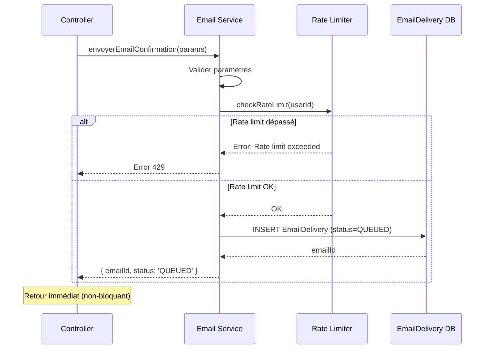
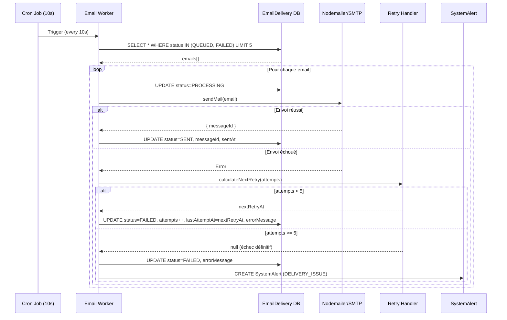
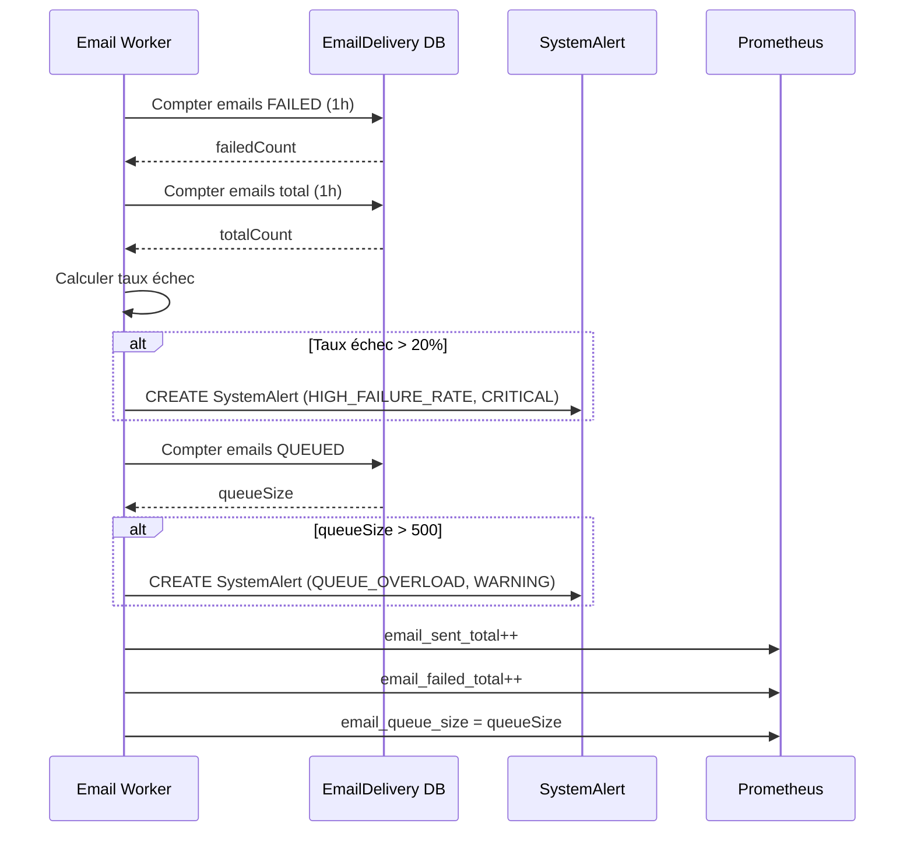

# Design Document - Système Email Notifications Performant

## 1. Architecture Overview

### 1.1 Vue d'ensemble

Le système d'email notifications est conçu selon une architecture asynchrone basée sur une file d'attente (queue) pour garantir la fiabilité et les performances. L'architecture se compose de quatre composants principaux qui collaborent pour assurer l'envoi fiable des emails.

### 1.2 Diagramme d'Architecture

```
┌─────────────────────────────────────────────────────────────────┐
│                     API Express Principal                        │
│                                                                   │
│  ┌──────────────┐      ┌──────────────┐      ┌──────────────┐  │
│  │ Controllers  │─────▶│Email Service │─────▶│ Rate Limiter │  │
│  │              │      │              │      │              │  │
│  │ - auth       │      │ - create()   │      │ - check()    │  │
│  │ - candidat   │      │ - queue()    │      │ - increment()│  │
│  │ - controleur │      │              │      │              │  │
│  └──────────────┘      └──────────────┘      └──────────────┘  │
│                               │                                  │
│                               ▼                                  │
│                    ┌──────────────────┐                         │
│                    │ EmailDelivery DB │                         │
│                    │  (status=QUEUED) │                         │
│                    └──────────────────┘                         │
│                               │                                  │
│                               ▼                                  │
│  ┌────────────────────────────────────────────────────┐        │
│  │           Email Worker (node-cron)                  │        │
│  │                                                      │        │
│  │  ┌──────────────┐      ┌──────────────┐           │        │
│  │  │ Cron Job     │─────▶│Retry Handler │           │        │
│  │  │ (every 10s)  │      │              │           │        │
│  │  │              │      │ - backoff    │           │        │
│  │  │ - fetch      │      │ - schedule   │           │        │
│  │  │ - process    │      │              │           │        │
│  │  └──────────────┘      └──────────────┘           │        │
│  │         │                                           │        │
│  │         ▼                                           │        │
│  │  ┌──────────────┐                                  │        │
│  │  │   Nodemailer │                                  │        │
│  │  │   (SMTP)     │                                  │        │
│  │  └──────────────┘                                  │        │
│  └────────────────────────────────────────────────────┘        │
│                               │                                  │
│                               ▼                                  │
│                    ┌──────────────────┐                         │
│                    │   SMTP Gmail     │                         │
│                    └──────────────────┘                         │
│                                                                   │
│  ┌────────────────────────────────────────────────────┐        │
│  │           Monitoring & Alerts                       │        │
│  │                                                      │        │
│  │  - SystemAlert table                                │        │
│  │  - Prometheus metrics                               │        │
│  │  - Health endpoint                                  │        │
│  └────────────────────────────────────────────────────┘        │
└─────────────────────────────────────────────────────────────────┘
```

### 1.3 Composants Principaux

#### 1.3.1 Email Service
**Responsabilité** : Créer les entrées dans la table `EmailDelivery` et gérer la logique métier des emails

**Fonctions** :
- Validation des paramètres (email, nom, prénom)
- Vérification du rate limiting
- Création d'entrée `EmailDelivery` avec statut `QUEUED`
- Retour immédiat au contrôleur (non-bloquant)

**Méthodes publiques** :
- `envoyerEmailConfirmation({ candidatEmail, candidatNom, candidatPrenom, confirmationToken })`
- `envoyerEmailBienvenue({ candidatEmail, candidatNom, candidatPrenom, matricule, loginUrl })`
- `envoyerEmailPreInscription({ candidatEmail, candidatNom, candidatPrenom, concours, numeroDossier }, pdfPath)`
- `envoyerEmailConvocation({ candidatEmail, candidatNom, candidatPrenom, concours, numeroDossier, dateExamen, lieuExamen }, pdfPath)`
- `envoyerEmailRejet({ candidatEmail, candidatNom, candidatPrenom, concours, motif })`
- `envoyerEmailSousReserve({ candidatEmail, candidatNom, candidatPrenom, concours, numeroDossier, motif })`

#### 1.3.2 Email Worker (Cron Job)
**Responsabilité** : Traiter la file d'attente et envoyer les emails via SMTP

**Caractéristiques** :
- Intégré au processus Express principal
- Utilise `node-cron` pour exécution périodique
- Fréquence : toutes les 10 secondes
- Traite jusqu'à 5 emails par cycle
- Démarre automatiquement avec l'API
- Arrêt gracieux avec le serveur

**Algorithme** :
```javascript
// Toutes les 10 secondes
cron.schedule('*/10 * * * * *', async () => {
  // 1. Récupérer 5 emails QUEUED ou FAILED (retry programmé)
  const emails = await prisma.emailDelivery.findMany({
    where: {
      OR: [
        { status: 'QUEUED' },
        { 
          status: 'FAILED',
          lastAttemptAt: { lt: new Date() }  // Retry programmé dans le passé
        }
      ]
    },
    take: 5,
    orderBy: { createdAt: 'asc' }
  });
  
  // 2. Traiter chaque email en parallèle
  await Promise.allSettled(
    emails.map(email => processEmail(email))
  );
});
```

#### 1.3.3 Retry Handler
**Responsabilité** : Gérer les tentatives automatiques en cas d'échec

**Stratégie Exponential Backoff** :
- Tentative 1 : Immédiat (0 min)
- Tentative 2 : +1 minute
- Tentative 3 : +5 minutes
- Tentative 4 : +15 minutes
- Tentative 5 : +1 heure
- Tentative 6 : +4 heures (dernière)

**Algorithme** :
```javascript
const RETRY_DELAYS = [0, 1, 5, 15, 60, 240];  // en minutes

function calculateNextRetry(attempts) {
  if (attempts >= 5) return null;  // Échec définitif
  const delayMinutes = RETRY_DELAYS[attempts + 1];
  return new Date(Date.now() + delayMinutes * 60 * 1000);
}
```

#### 1.3.4 Rate Limiter
**Responsabilité** : Prévenir les abus et respecter les limites SMTP

**Limites** :
- **Par utilisateur** : 10 emails/heure
- **Globale** : 100 emails/heure

**Implémentation** :
```javascript
async function checkRateLimit(userId) {
  const oneHourAgo = new Date(Date.now() - 60 * 60 * 1000);
  
  // Vérifier limite par utilisateur
  const userCount = await prisma.emailDelivery.count({
    where: {
      userId,
      createdAt: { gte: oneHourAgo },
      status: { in: ['SENT', 'PROCESSING', 'QUEUED'] }
    }
  });
  
  if (userCount >= 10) {
    throw new Error('Rate limit exceeded: 10 emails per hour per user');
  }
  
  // Vérifier limite globale
  const globalCount = await prisma.emailDelivery.count({
    where: {
      createdAt: { gte: oneHourAgo },
      status: { in: ['SENT', 'PROCESSING', 'QUEUED'] }
    }
  });
  
  if (globalCount >= 100) {
    throw new Error('Rate limit exceeded: 100 emails per hour globally');
  }
}
```

### 1.4 Flux de Données

#### Flux 1 : Envoi d'Email (Création)



#### Flux 2 : Traitement par le Worker



#### Flux 3 : Monitoring et Alertes




## 2. Component Design

### 2.1 Email Service (`email.service.js`)

#### 2.1.1 Structure du Module

```javascript
// email.service.js
const nodemailer = require('nodemailer');
const prisma = require('../prisma');
const { checkRateLimit } = require('./rate-limiter');
const { validateEmail, validateParams } = require('../utils/validation');

class EmailService {
  constructor() {
    this.transporter = nodemailer.createTransport({
      host: process.env.SMTP_HOST,
      port: parseInt(process.env.SMTP_PORT || '587'),
      secure: false,
      auth: {
        user: process.env.SMTP_USER,
        pass: process.env.SMTP_PASS,
      },
    });
  }

  /**
   * Méthode générique pour créer un email dans la queue
   */
  async createEmail({ userId, recipient, subject, htmlBody, textBody, attachments = [], emailType }) {
    // 1. Validation
    if (!validateEmail(recipient)) {
      throw new Error('Invalid email address');
    }

    // 2. Rate limiting
    await checkRateLimit(userId);

    // 3. Créer l'entrée dans EmailDelivery
    const email = await prisma.emailDelivery.create({
      data: {
        userId,
        recipient,
        subject,
        status: 'QUEUED',
        attempts: 0,
        createdAt: new Date(),
      },
    });

    // 4. Stocker le contenu et les pièces jointes (si nécessaire)
    // Note: Pour simplifier, on peut stocker htmlBody/textBody dans un champ JSON
    // ou dans une table séparée EmailContent

    return { emailId: email.id, status: 'QUEUED' };
  }

  /**
   * Email de confirmation de compte
   */
  async envoyerEmailConfirmation({ candidatEmail, candidatNom, candidatPrenom, confirmationToken }) {
    validateParams({ candidatEmail, candidatNom, candidatPrenom, confirmationToken });

    const confirmationUrl = `${process.env.APP_URL}/confirmer-email?token=${confirmationToken}`;
    const subject = 'Confirmez votre compte UniPath';
    const htmlBody = `
      <h2>Bienvenue ${candidatPrenom} ${candidatNom}!</h2>
      <p>Merci de vous être inscrit sur UniPath.</p>
      <p>Pour activer votre compte, veuillez cliquer sur le lien ci-dessous :</p>
      <a href="${confirmationUrl}">Confirmer mon compte</a>
      <p>Ce lien expire dans 24 heures.</p>
      <p>Si vous n'avez pas créé de compte, ignorez cet email.</p>
    `;

    return this.createEmail({
      userId: null,  // Pas encore de candidat créé
      recipient: candidatEmail,
      subject,
      htmlBody,
      emailType: 'CONFIRMATION',
    });
  }

  /**
   * Email de bienvenue (après confirmation)
   */
  async envoyerEmailBienvenue({ candidatEmail, candidatNom, candidatPrenom, matricule, loginUrl }) {
    validateParams({ candidatEmail, candidatNom, candidatPrenom, matricule });

    const subject = 'Bienvenue sur UniPath - Votre compte est activé';
    const htmlBody = `
      <h2>Félicitations ${candidatPrenom} ${candidatNom}!</h2>
      <p>Votre compte UniPath est maintenant activé.</p>
      <p><strong>Votre matricule :</strong> ${matricule}</p>
      <p><strong>Votre email de connexion :</strong> ${candidatEmail}</p>
      <p>Vous pouvez maintenant vous connecter et vous inscrire aux concours :</p>
      <a href="${loginUrl || process.env.APP_URL}">Accéder à la plateforme</a>
      <p>Bonne chance pour vos concours!</p>
    `;

    return this.createEmail({
      userId: null,  // À récupérer depuis le candidat
      recipient: candidatEmail,
      subject,
      htmlBody,
      emailType: 'BIENVENUE',
    });
  }

  /**
   * Email de pré-inscription avec PDF
   */
  async envoyerEmailPreInscription({ candidatEmail, candidatNom, candidatPrenom, concours, numeroDossier }, pdfPath) {
    validateParams({ candidatEmail, candidatNom, candidatPrenom, concours, numeroDossier });

    const subject = `Confirmation d'inscription - ${concours}`;
    const htmlBody = `
      <h2>Inscription enregistrée</h2>
      <p>Bonjour ${candidatPrenom} ${candidatNom},</p>
      <p>Votre inscription au concours <strong>${concours}</strong> a été enregistrée avec succès.</p>
      <p><strong>Numéro de dossier :</strong> ${numeroDossier}</p>
      <p>Veuillez trouver ci-joint votre fiche de pré-inscription.</p>
      <p>Pour finaliser votre inscription, veuillez compléter votre dossier avec les pièces requises.</p>
    `;

    const attachments = pdfPath ? [{
      filename: `fiche-preinscription-${numeroDossier}.pdf`,
      path: pdfPath,
    }] : [];

    return this.createEmail({
      userId: null,  // À récupérer
      recipient: candidatEmail,
      subject,
      htmlBody,
      attachments,
      emailType: 'PRE_INSCRIPTION',
    });
  }

  /**
   * Email de convocation avec PDF
   */
  async envoyerEmailConvocation({ candidatEmail, candidatNom, candidatPrenom, concours, numeroDossier, dateExamen, lieuExamen }, pdfPath) {
    validateParams({ candidatEmail, candidatNom, candidatPrenom, concours, numeroDossier });

    const subject = `Convocation - ${concours}`;
    const htmlBody = `
      <h2>Félicitations! Vous êtes convoqué(e)</h2>
      <p>Bonjour ${candidatPrenom} ${candidatNom},</p>
      <p>Votre dossier pour le concours <strong>${concours}</strong> a été validé.</p>
      <p><strong>Numéro de dossier :</strong> ${numeroDossier}</p>
      ${dateExamen ? `<p><strong>Date de l'examen :</strong> ${dateExamen}</p>` : ''}
      ${lieuExamen ? `<p><strong>Lieu :</strong> ${lieuExamen}</p>` : ''}
      <p>Veuillez trouver ci-joint votre convocation officielle.</p>
      <p><strong>Important :</strong> Présentez-vous avec votre convocation et une pièce d'identité valide.</p>
    `;

    const attachments = pdfPath ? [{
      filename: `convocation-${numeroDossier}.pdf`,
      path: pdfPath,
    }] : [];

    return this.createEmail({
      userId: null,
      recipient: candidatEmail,
      subject,
      htmlBody,
      attachments,
      emailType: 'CONVOCATION',
    });
  }

  /**
   * Email de rejet
   */
  async envoyerEmailRejet({ candidatEmail, candidatNom, candidatPrenom, concours, motif }) {
    validateParams({ candidatEmail, candidatNom, candidatPrenom, concours });

    const motifFinal = motif || "Votre dossier ne répond pas aux critères d'admission";
    const subject = `Décision concernant votre inscription - ${concours}`;
    const htmlBody = `
      <h2>Décision concernant votre dossier</h2>
      <p>Bonjour ${candidatPrenom} ${candidatNom},</p>
      <p>Nous avons le regret de vous informer que votre dossier pour le concours <strong>${concours}</strong> n'a pas été retenu.</p>
      <p><strong>Motif :</strong> ${motifFinal}</p>
      <p>Pour toute réclamation, veuillez contacter le service des concours à l'adresse : concours@uac.bj</p>
      <p>Nous vous encourageons à postuler à nouveau lors des prochaines sessions.</p>
    `;

    return this.createEmail({
      userId: null,
      recipient: candidatEmail,
      subject,
      htmlBody,
      emailType: 'REJET',
    });
  }

  /**
   * Email de validation sous réserve
   */
  async envoyerEmailSousReserve({ candidatEmail, candidatNom, candidatPrenom, concours, numeroDossier, motif }) {
    validateParams({ candidatEmail, candidatNom, candidatPrenom, concours, numeroDossier });

    const conditions = motif || "Veuillez compléter votre dossier selon les instructions de la commission";
    const dateLimite = new Date(Date.now() + 48 * 60 * 60 * 1000).toLocaleDateString('fr-FR');
    const subject = `Validation sous réserve - ${concours}`;
    const htmlBody = `
      <h2>Validation sous réserve</h2>
      <p>Bonjour ${candidatPrenom} ${candidatNom},</p>
      <p>Votre dossier pour le concours <strong>${concours}</strong> a été validé sous réserve.</p>
      <p><strong>Numéro de dossier :</strong> ${numeroDossier}</p>
      <p><strong>Conditions à remplir :</strong></p>
      <p>${conditions}</p>
      <p><strong>Date limite :</strong> ${dateLimite} (48 heures)</p>
      <p>Veuillez compléter votre dossier dans les délais pour finaliser votre inscription.</p>
    `;

    return this.createEmail({
      userId: null,
      recipient: candidatEmail,
      subject,
      htmlBody,
      emailType: 'SOUS_RESERVE',
    });
  }
}

module.exports = new EmailService();
```

### 2.2 Email Worker (`email.worker.js`)

#### 2.2.1 Implémentation avec node-cron

```javascript
// email.worker.js
const cron = require('node-cron');
const nodemailer = require('nodemailer');
const prisma = require('../prisma');
const fs = require('fs');

class EmailWorker {
  constructor() {
    this.transporter = nodemailer.createTransport({
      host: process.env.SMTP_HOST,
      port: parseInt(process.env.SMTP_PORT || '587'),
      secure: false,
      auth: {
        user: process.env.SMTP_USER,
        pass: process.env.SMTP_PASS,
      },
    });

    this.isProcessing = false;
    this.cronJob = null;
  }

  /**
   * Démarrer le worker
   */
  start() {
    console.log('[EmailWorker] Starting email worker...');

    // Exécuter toutes les 10 secondes
    this.cronJob = cron.schedule('*/10 * * * * *', async () => {
      if (this.isProcessing) {
        console.log('[EmailWorker] Already processing, skipping this cycle');
        return;
      }

      this.isProcessing = true;
      try {
        await this.processQueue();
      } catch (error) {
        console.error('[EmailWorker] Error processing queue:', error);
      } finally {
        this.isProcessing = false;
      }
    });

    console.log('[EmailWorker] Email worker started successfully');
  }

  /**
   * Arrêter le worker
   */
  stop() {
    console.log('[EmailWorker] Stopping email worker...');
    if (this.cronJob) {
      this.cronJob.stop();
    }
    console.log('[EmailWorker] Email worker stopped');
  }

  /**
   * Traiter la file d'attente
   */
  async processQueue() {
    // 1. Récupérer jusqu'à 5 emails à traiter
    const emails = await prisma.emailDelivery.findMany({
      where: {
        OR: [
          { status: 'QUEUED' },
          {
            status: 'FAILED',
            lastAttemptAt: { lt: new Date() },  // Retry programmé dans le passé
          },
        ],
      },
      take: 5,
      orderBy: { createdAt: 'asc' },
    });

    if (emails.length === 0) {
      return;
    }

    console.log(`[EmailWorker] Processing ${emails.length} emails`);

    // 2. Traiter chaque email en parallèle
    await Promise.allSettled(
      emails.map(email => this.processEmail(email))
    );
  }

  /**
   * Traiter un email individuel
   */
  async processEmail(email) {
    try {
      // 1. Mettre à jour le statut à PROCESSING
      await prisma.emailDelivery.update({
        where: { id: email.id },
        data: { status: 'PROCESSING' },
      });

      // 2. Préparer le contenu de l'email
      // Note: Dans une implémentation complète, récupérer htmlBody/textBody depuis une table séparée
      const mailOptions = {
        from: `${process.env.SMTP_FROM_NAME} <${process.env.SMTP_FROM_EMAIL}>`,
        to: email.recipient,
        subject: email.subject,
        html: email.htmlBody || '<p>Email content</p>',
        // attachments: email.attachments  // À implémenter
      };

      // 3. Envoyer l'email
      const info = await this.transporter.sendMail(mailOptions);

      // 4. Mettre à jour le statut à SENT
      await prisma.emailDelivery.update({
        where: { id: email.id },
        data: {
          status: 'SENT',
          messageId: info.messageId,
          sentAt: new Date(),
          attempts: email.attempts + 1,
          lastAttemptAt: new Date(),
        },
      });

      console.log(`[EmailWorker] Email ${email.id} sent successfully (messageId: ${info.messageId})`);

    } catch (error) {
      console.error(`[EmailWorker] Error sending email ${email.id}:`, error);

      // Calculer la prochaine tentative
      const nextRetry = this.calculateNextRetry(email.attempts);

      if (nextRetry) {
        // Retry programmé
        await prisma.emailDelivery.update({
          where: { id: email.id },
          data: {
            status: 'FAILED',
            attempts: email.attempts + 1,
            lastAttemptAt: nextRetry,
            errorMessage: error.message,
            smtpCode: error.code || null,
          },
        });

        console.log(`[EmailWorker] Email ${email.id} failed, retry scheduled at ${nextRetry}`);
      } else {
        // Échec définitif
        await prisma.emailDelivery.update({
          where: { id: email.id },
          data: {
            status: 'FAILED',
            attempts: email.attempts + 1,
            lastAttemptAt: new Date(),
            errorMessage: error.message,
            smtpCode: error.code || null,
          },
        });

        // Créer une alerte
        await prisma.systemAlert.create({
          data: {
            type: 'DELIVERY_ISSUE',
            severity: 'ERROR',
            title: 'Email delivery failed permanently',
            message: `Email ${email.id} to ${email.recipient} failed after ${email.attempts + 1} attempts`,
            data: {
              emailId: email.id,
              recipient: email.recipient,
              error: error.message,
            },
          },
        });

        console.error(`[EmailWorker] Email ${email.id} failed permanently after ${email.attempts + 1} attempts`);
      }
    }
  }

  /**
   * Calculer la prochaine tentative (exponential backoff)
   */
  calculateNextRetry(attempts) {
    const RETRY_DELAYS = [0, 1, 5, 15, 60, 240];  // en minutes

    if (attempts >= 5) {
      return null;  // Échec définitif
    }

    const delayMinutes = RETRY_DELAYS[attempts + 1];
    return new Date(Date.now() + delayMinutes * 60 * 1000);
  }
}

module.exports = new EmailWorker();
```

#### 2.2.2 Intégration dans server.js

```javascript
// server.js
const express = require('express');
const emailWorker = require('./services/email.worker');

const app = express();

// ... Configuration Express ...

// Démarrer le worker au lancement du serveur
emailWorker.start();

// Arrêt gracieux
process.on('SIGTERM', () => {
  console.log('SIGTERM received, shutting down gracefully');
  emailWorker.stop();
  server.close(() => {
    console.log('Server closed');
    process.exit(0);
  });
});

process.on('SIGINT', () => {
  console.log('SIGINT received, shutting down gracefully');
  emailWorker.stop();
  server.close(() => {
    console.log('Server closed');
    process.exit(0);
  });
});

const PORT = process.env.PORT || 3000;
const server = app.listen(PORT, () => {
  console.log(`Server running on port ${PORT}`);
});
```

### 2.3 Rate Limiter (`rate-limiter.js`)

```javascript
// services/rate-limiter.js
const prisma = require('../prisma');

class RateLimiter {
  constructor() {
    this.userLimit = parseInt(process.env.EMAIL_RATE_LIMIT_PER_USER || '10');
    this.globalLimit = parseInt(process.env.EMAIL_RATE_LIMIT_GLOBAL || '100');
  }

  /**
   * Vérifier les limites de rate limiting
   */
  async checkRateLimit(userId) {
    const oneHourAgo = new Date(Date.now() - 60 * 60 * 1000);

    // Vérifier limite par utilisateur
    if (userId) {
      const userCount = await prisma.emailDelivery.count({
        where: {
          userId,
          createdAt: { gte: oneHourAgo },
          status: { in: ['SENT', 'PROCESSING', 'QUEUED'] },
        },
      });

      if (userCount >= this.userLimit) {
        throw new Error(`Rate limit exceeded: ${this.userLimit} emails per hour per user`);
      }
    }

    // Vérifier limite globale
    const globalCount = await prisma.emailDelivery.count({
      where: {
        createdAt: { gte: oneHourAgo },
        status: { in: ['SENT', 'PROCESSING', 'QUEUED'] },
      },
    });

    if (globalCount >= this.globalLimit) {
      // Créer une alerte si la queue est surchargée
      if (globalCount > 500) {
        await prisma.systemAlert.create({
          data: {
            type: 'QUEUE_OVERLOAD',
            severity: 'WARNING',
            title: 'Email queue overloaded',
            message: `Email queue contains ${globalCount} emails`,
            data: { queueSize: globalCount },
          },
        });
      }

      throw new Error(`Rate limit exceeded: ${this.globalLimit} emails per hour globally`);
    }
  }
}

module.exports = new RateLimiter();
```

## 3. Data Models

### 3.1 Table EmailDelivery (Existante)

La table `EmailDelivery` existe déjà dans le schéma Prisma et sera utilisée telle quelle.

```prisma
model EmailDelivery {
  id             String         @id @default(uuid())
  notificationId String?        // Peut être null pour emails legacy
  userId         String
  recipient      String
  subject        String
  status         DeliveryStatus @default(PENDING)
  messageId      String?        // ID du serveur SMTP
  attempts       Int            @default(0)
  lastAttemptAt  DateTime?
  sentAt         DateTime?
  deliveredAt    DateTime?
  bouncedAt      DateTime?
  errorMessage   String?        @db.Text
  smtpCode       String?
  createdAt      DateTime       @default(now())
  updatedAt      DateTime       @updatedAt

  @@index([notificationId])
  @@index([userId])
  @@index([status])
  @@index([createdAt(sort: Desc)])
}

enum DeliveryStatus {
  PENDING
  QUEUED
  PROCESSING
  SENT
  DELIVERED
  FAILED
  BOUNCED
  EXPIRED
}
```

### 3.2 Champs Additionnels Nécessaires

Pour stocker le contenu HTML/Text et les pièces jointes, deux approches possibles :

#### Approche 1 : Ajouter des champs à EmailDelivery (Simple)

```prisma
model EmailDelivery {
  // ... champs existants ...
  htmlBody       String?        @db.Text
  textBody       String?        @db.Text
  attachments    Json?          // Array de { filename, path, contentType }
}
```

#### Approche 2 : Table séparée EmailContent (Recommandé)

```prisma
model EmailContent {
  id             String         @id @default(uuid())
  emailId        String         @unique
  htmlBody       String         @db.Text
  textBody       String?        @db.Text
  attachments    Json?
  createdAt      DateTime       @default(now())
  
  email          EmailDelivery  @relation(fields: [emailId], references: [id], onDelete: Cascade)
  
  @@index([emailId])
}
```

**Recommandation** : Utiliser l'Approche 1 pour simplifier l'implémentation initiale.

### 3.3 Migration Prisma

```prisma
// prisma/migrations/YYYYMMDDHHMMSS_add_email_content_fields/migration.sql

-- Add htmlBody, textBody, and attachments fields to EmailDelivery
ALTER TABLE "EmailDelivery" ADD COLUMN "htmlBody" TEXT;
ALTER TABLE "EmailDelivery" ADD COLUMN "textBody" TEXT;
ALTER TABLE "EmailDelivery" ADD COLUMN "attachments" JSONB;
```

## 4. API Specifications

### 4.1 Endpoints Internes (Utilisés par les Controllers)

Les méthodes du `EmailService` sont appelées directement par les contrôleurs, il n'y a pas d'endpoints HTTP publics pour créer des emails.

### 4.2 Endpoint de Monitoring

#### GET `/api/email/health`

**Description** : Vérifier l'état du système d'email

**Permissions** : DGES, CONTROLEUR

**Réponse** :
```json
{
  "status": "healthy",
  "queue": {
    "queued": 12,
    "processing": 2,
    "failed": 3
  },
  "stats": {
    "last24h": {
      "sent": 245,
      "failed": 8,
      "failureRate": 3.2
    },
    "lastHour": {
      "sent": 18,
      "failed": 1,
      "failureRate": 5.3
    }
  },
  "worker": {
    "running": true,
    "lastRun": "2024-01-20T14:30:10Z"
  },
  "alerts": [
    {
      "type": "QUEUE_OVERLOAD",
      "severity": "WARNING",
      "message": "Email queue contains 512 emails",
      "createdAt": "2024-01-20T14:25:00Z"
    }
  ]
}
```

#### GET `/api/email/stats`

**Description** : Statistiques détaillées des emails

**Permissions** : DGES, CONTROLEUR

**Query Parameters** :
- `period` : `hour` | `day` | `week` | `month` (défaut: `day`)

**Réponse** :
```json
{
  "period": "day",
  "startDate": "2024-01-20T00:00:00Z",
  "endDate": "2024-01-20T23:59:59Z",
  "total": 253,
  "byStatus": {
    "SENT": 245,
    "FAILED": 8,
    "QUEUED": 0,
    "PROCESSING": 0
  },
  "byType": {
    "CONFIRMATION": 45,
    "BIENVENUE": 42,
    "PRE_INSCRIPTION": 78,
    "CONVOCATION": 52,
    "REJET": 18,
    "SOUS_RESERVE": 18
  },
  "failureRate": 3.2,
  "averageDeliveryTime": 12.5
}
```

## 5. Error Handling

### 5.1 Types d'Erreurs

#### 5.1.1 Erreurs de Validation
- Email invalide
- Paramètres manquants
- Format de fichier incorrect

**Gestion** : Rejeter immédiatement avec erreur 400

#### 5.1.2 Erreurs de Rate Limiting
- Limite par utilisateur dépassée (10/h)
- Limite globale dépassée (100/h)

**Gestion** : Rejeter avec erreur 429, créer alerte si queue > 500

#### 5.1.3 Erreurs SMTP
- Authentification échouée
- Destinataire invalide
- Quota dépassé
- Timeout réseau

**Gestion** : Retry automatique avec exponential backoff

#### 5.1.4 Erreurs de Fichier
- Fichier PDF non trouvé
- Fichier trop volumineux (> 5MB)

**Gestion** : Envoyer email sans pièce jointe, logger l'erreur

### 5.2 Stratégie de Retry

```javascript
const RETRY_STRATEGY = {
  maxAttempts: 5,
  delays: [0, 1, 5, 15, 60, 240],  // minutes
  retryableErrors: [
    'ETIMEDOUT',
    'ECONNREFUSED',
    'ENOTFOUND',
    'ESOCKET',
    'SMTP_TIMEOUT',
  ],
  nonRetryableErrors: [
    'INVALID_EMAIL',
    'AUTHENTICATION_FAILED',
    'QUOTA_EXCEEDED',
  ],
};

function shouldRetry(error, attempts) {
  if (attempts >= RETRY_STRATEGY.maxAttempts) {
    return false;
  }
  
  if (RETRY_STRATEGY.nonRetryableErrors.includes(error.code)) {
    return false;
  }
  
  return true;
}
```

### 5.3 Logging

```javascript
// Utiliser Winston pour les logs structurés
const winston = require('winston');

const logger = winston.createLogger({
  level: 'info',
  format: winston.format.combine(
    winston.format.timestamp(),
    winston.format.json()
  ),
  transports: [
    new winston.transports.File({ filename: 'logs/email-error.log', level: 'error' }),
    new winston.transports.File({ filename: 'logs/email-combined.log' }),
  ],
});

// Exemples de logs
logger.info('Email sent successfully', {
  emailId: 'uuid',
  recipient: 'john@example.com',
  messageId: 'smtp-message-id',
  attempts: 1,
});

logger.error('Email failed permanently', {
  emailId: 'uuid',
  recipient: 'john@example.com',
  error: 'SMTP timeout',
  attempts: 5,
});
```

## 6. Security Considerations

### 6.1 Protection des Données

#### 6.1.1 Masquage des Emails dans les Logs
```javascript
function maskEmail(email) {
  const [local, domain] = email.split('@');
  return `${local.substring(0, 3)}***@${domain}`;
}

// Exemple: john.doe@example.com → joh***@example.com
```

#### 6.1.2 Expiration des Tokens
- Token de confirmation : 24 heures
- Stockage dans Supabase Auth avec expiration automatique

#### 6.1.3 Validation des Entrées
```javascript
function validateEmail(email) {
  const regex = /^[^\s@]+@[^\s@]+\.[^\s@]+$/;
  return regex.test(email);
}

function sanitizeInput(input) {
  // Prévenir les injections XSS
  return input
    .replace(/</g, '&lt;')
    .replace(/>/g, '&gt;')
    .replace(/"/g, '&quot;')
    .replace(/'/g, '&#x27;');
}
```

### 6.2 Sécurité SMTP

#### 6.2.1 Configuration TLS
```javascript
const transporter = nodemailer.createTransport({
  host: process.env.SMTP_HOST,
  port: 587,
  secure: false,  // true pour port 465
  requireTLS: true,  // Forcer TLS
  auth: {
    user: process.env.SMTP_USER,
    pass: process.env.SMTP_PASS,
  },
  tls: {
    rejectUnauthorized: true,  // Vérifier les certificats
  },
});
```

#### 6.2.2 Protection des Credentials
- Stocker dans variables d'environnement
- Ne jamais logger les credentials
- Utiliser des secrets managers en production (AWS Secrets Manager, Azure Key Vault)

### 6.3 Rate Limiting et Anti-Spam

#### 6.3.1 Limites Strictes
- 10 emails/heure par utilisateur
- 100 emails/heure globalement
- Blacklist d'adresses email suspectes

#### 6.3.2 Détection d'Abus
```javascript
async function detectAbuse(userId) {
  const last24h = new Date(Date.now() - 24 * 60 * 60 * 1000);
  
  const count = await prisma.emailDelivery.count({
    where: {
      userId,
      createdAt: { gte: last24h },
    },
  });
  
  if (count > 50) {
    // Créer une alerte
    await prisma.systemAlert.create({
      data: {
        type: 'SYSTEM_ERROR',
        severity: 'CRITICAL',
        title: 'Potential email abuse detected',
        message: `User ${userId} sent ${count} emails in 24h`,
        data: { userId, count },
      },
    });
    
    return true;
  }
  
  return false;
}
```

## 7. Performance Optimization

### 7.1 Optimisations Base de Données

#### 7.1.1 Index Nécessaires
```sql
-- Index pour la requête du worker
CREATE INDEX idx_emaildelivery_status_createdat 
ON "EmailDelivery" (status, "createdAt") 
WHERE status IN ('QUEUED', 'FAILED');

-- Index pour le rate limiting
CREATE INDEX idx_emaildelivery_userid_createdat 
ON "EmailDelivery" ("userId", "createdAt");

-- Index pour les statistiques
CREATE INDEX idx_emaildelivery_createdat_status 
ON "EmailDelivery" ("createdAt", status);
```

#### 7.1.2 Nettoyage Automatique
```javascript
// Supprimer les emails SENT de plus de 90 jours
cron.schedule('0 2 * * *', async () => {  // Tous les jours à 2h
  const ninetyDaysAgo = new Date(Date.now() - 90 * 24 * 60 * 60 * 1000);
  
  const deleted = await prisma.emailDelivery.deleteMany({
    where: {
      status: 'SENT',
      sentAt: { lt: ninetyDaysAgo },
    },
  });
  
  console.log(`[Cleanup] Deleted ${deleted.count} old emails`);
});
```

### 7.2 Optimisations Worker

#### 7.2.1 Traitement Parallèle
- Traiter 5 emails en parallèle par cycle
- Utiliser `Promise.allSettled()` pour ne pas bloquer sur une erreur

#### 7.2.2 Connection Pooling
```javascript
// Réutiliser la connexion SMTP
const transporter = nodemailer.createTransport({
  pool: true,  // Activer le pooling
  maxConnections: 5,  // Max 5 connexions simultanées
  maxMessages: 100,  // Réutiliser la connexion pour 100 messages
  // ... autres options
});
```

### 7.3 Métriques Prometheus

```javascript
const promClient = require('prom-client');

// Compteurs
const emailSentTotal = new promClient.Counter({
  name: 'email_sent_total',
  help: 'Total number of emails sent',
  labelNames: ['type', 'status'],
});

const emailFailedTotal = new promClient.Counter({
  name: 'email_failed_total',
  help: 'Total number of emails failed',
  labelNames: ['type', 'error_code'],
});

// Gauges
const emailQueueSize = new promClient.Gauge({
  name: 'email_queue_size',
  help: 'Current size of email queue',
});

// Histogrammes
const emailProcessingDuration = new promClient.Histogram({
  name: 'email_processing_duration_seconds',
  help: 'Email processing duration in seconds',
  buckets: [0.1, 0.5, 1, 2, 5, 10],
});

// Utilisation
emailSentTotal.inc({ type: 'CONFIRMATION', status: 'SENT' });
emailQueueSize.set(await getQueueSize());
```

## 8. Testing Strategy

### 8.1 Tests Unitaires

#### 8.1.1 Email Service
```javascript
// tests/email.service.test.js
const emailService = require('../services/email.service');
const prisma = require('../prisma');

jest.mock('../prisma');
jest.mock('../services/rate-limiter');

describe('EmailService', () => {
  describe('envoyerEmailConfirmation', () => {
    it('should create email with QUEUED status', async () => {
      const params = {
        candidatEmail: 'john@example.com',
        candidatNom: 'DOE',
        candidatPrenom: 'John',
        confirmationToken: 'token123',
      };

      prisma.emailDelivery.create.mockResolvedValue({
        id: 'email-id',
        status: 'QUEUED',
      });

      const result = await emailService.envoyerEmailConfirmation(params);

      expect(result).toEqual({ emailId: 'email-id', status: 'QUEUED' });
      expect(prisma.emailDelivery.create).toHaveBeenCalledWith({
        data: expect.objectContaining({
          recipient: 'john@example.com',
          status: 'QUEUED',
        }),
      });
    });

    it('should throw error for invalid email', async () => {
      const params = {
        candidatEmail: 'invalid-email',
        candidatNom: 'DOE',
        candidatPrenom: 'John',
        confirmationToken: 'token123',
      };

      await expect(emailService.envoyerEmailConfirmation(params))
        .rejects.toThrow('Invalid email address');
    });
  });
});
```

#### 8.1.2 Email Worker
```javascript
// tests/email.worker.test.js
const emailWorker = require('../services/email.worker');
const nodemailer = require('nodemailer');

jest.mock('nodemailer');

describe('EmailWorker', () => {
  describe('processEmail', () => {
    it('should send email and update status to SENT', async () => {
      const email = {
        id: 'email-id',
        recipient: 'john@example.com',
        subject: 'Test',
        htmlBody: '<p>Test</p>',
        attempts: 0,
      };

      const sendMailMock = jest.fn().mockResolvedValue({
        messageId: 'smtp-message-id',
      });

      nodemailer.createTransport.mockReturnValue({
        sendMail: sendMailMock,
      });

      await emailWorker.processEmail(email);

      expect(sendMailMock).toHaveBeenCalled();
      expect(prisma.emailDelivery.update).toHaveBeenCalledWith({
        where: { id: 'email-id' },
        data: expect.objectContaining({
          status: 'SENT',
          messageId: 'smtp-message-id',
        }),
      });
    });

    it('should schedule retry on failure', async () => {
      const email = {
        id: 'email-id',
        recipient: 'john@example.com',
        subject: 'Test',
        htmlBody: '<p>Test</p>',
        attempts: 0,
      };

      const sendMailMock = jest.fn().mockRejectedValue(new Error('SMTP timeout'));

      nodemailer.createTransport.mockReturnValue({
        sendMail: sendMailMock,
      });

      await emailWorker.processEmail(email);

      expect(prisma.emailDelivery.update).toHaveBeenCalledWith({
        where: { id: 'email-id' },
        data: expect.objectContaining({
          status: 'FAILED',
          attempts: 1,
          lastAttemptAt: expect.any(Date),
        }),
      });
    });
  });
});
```

### 8.2 Tests d'Intégration

```javascript
// tests/integration/email.integration.test.js
describe('Email Integration Tests', () => {
  it('should send confirmation email end-to-end', async () => {
    // 1. Créer un email
    const result = await emailService.envoyerEmailConfirmation({
      candidatEmail: 'test@example.com',
      candidatNom: 'TEST',
      candidatPrenom: 'User',
      confirmationToken: 'token123',
    });

    expect(result.status).toBe('QUEUED');

    // 2. Attendre que le worker traite l'email
    await new Promise(resolve => setTimeout(resolve, 15000));  // 15 secondes

    // 3. Vérifier que l'email a été envoyé
    const email = await prisma.emailDelivery.findUnique({
      where: { id: result.emailId },
    });

    expect(email.status).toBe('SENT');
    expect(email.messageId).toBeTruthy();
  });
});
```

### 8.3 Tests de Charge

```javascript
// tests/load/email.load.test.js
const { performance } = require('perf_hooks');

describe('Email Load Tests', () => {
  it('should handle 100 emails in less than 5 minutes', async () => {
    const start = performance.now();

    // Créer 100 emails
    const promises = [];
    for (let i = 0; i < 100; i++) {
      promises.push(
        emailService.envoyerEmailConfirmation({
          candidatEmail: `test${i}@example.com`,
          candidatNom: 'TEST',
          candidatPrenom: `User${i}`,
          confirmationToken: `token${i}`,
        })
      );
    }

    await Promise.all(promises);

    const end = performance.now();
    const duration = (end - start) / 1000;  // en secondes

    expect(duration).toBeLessThan(300);  // 5 minutes
  });
});
```

## 9. Migration Plan

### 9.1 Phase 1 : Préparation (Semaine 1)

#### Tâches
1. Ajouter les champs `htmlBody`, `textBody`, `attachments` à `EmailDelivery`
2. Créer les index nécessaires
3. Installer les dépendances : `node-cron`, `winston`
4. Configurer les variables d'environnement

#### Migration Prisma
```bash
npx prisma migrate dev --name add_email_content_fields
```

#### Variables d'Environnement
```env
# SMTP Configuration
SMTP_HOST=smtp.gmail.com
SMTP_PORT=587
SMTP_USER=your-email@gmail.com
SMTP_PASS=your-app-password
SMTP_FROM_EMAIL=noreply@unipath.bj
SMTP_FROM_NAME=UniPath

# Application
APP_URL=https://unipath.bj
ACADEMIC_YEAR=2024-2025

# Email Queue
EMAIL_QUEUE_ENABLED=true
EMAIL_RETRY_DELAYS=1,5,15,60,240
EMAIL_RATE_LIMIT_PER_USER=10
EMAIL_RATE_LIMIT_GLOBAL=100
```

### 9.2 Phase 2 : Implémentation (Semaine 2-3)

#### Tâches
1. Refactorer `email.service.js`
2. Créer `email.worker.js`
3. Créer `rate-limiter.js`
4. Intégrer le worker dans `server.js`
5. Créer les endpoints de monitoring

#### Tests
- Tests unitaires pour chaque composant
- Tests d'intégration end-to-end
- Tests de charge avec 100 emails

### 9.3 Phase 3 : Migration Progressive (Semaine 4)

#### Stratégie
1. Déployer avec `EMAIL_QUEUE_ENABLED=false` (mode synchrone)
2. Vérifier que tout fonctionne comme avant
3. Activer progressivement par type d'email :
   - Jour 1 : CONFIRMATION uniquement
   - Jour 2 : BIENVENUE
   - Jour 3 : PRE_INSCRIPTION
   - Jour 4 : CONVOCATION, REJET, SOUS_RESERVE

#### Monitoring
- Surveiller les métriques Prometheus
- Vérifier les alertes dans `SystemAlert`
- Analyser les logs Winston

### 9.4 Phase 4 : Optimisation (Semaine 5)

#### Tâches
1. Ajuster les paramètres de retry si nécessaire
2. Optimiser les index de base de données
3. Configurer le nettoyage automatique
4. Documenter les procédures opérationnelles

#### Rollback Plan
Si problème critique :
1. Mettre `EMAIL_QUEUE_ENABLED=false`
2. Redémarrer le serveur
3. Analyser les logs et corriger
4. Réactiver après correction

## 10. Operational Procedures

### 10.1 Démarrage et Arrêt

#### Démarrage Normal
```bash
npm start
# Le worker démarre automatiquement
```

#### Arrêt Gracieux
```bash
# SIGTERM ou SIGINT
kill -TERM <pid>
# Le worker termine les emails en cours avant de s'arrêter
```

### 10.2 Monitoring

#### Vérifier l'État du Système
```bash
curl http://localhost:3000/api/email/health
```

#### Consulter les Logs
```bash
tail -f logs/email-combined.log
tail -f logs/email-error.log
```

#### Consulter les Alertes
```sql
SELECT * FROM "SystemAlert" 
WHERE type IN ('HIGH_FAILURE_RATE', 'QUEUE_OVERLOAD', 'SMTP_ERROR', 'DELIVERY_ISSUE')
AND resolved = false
ORDER BY "createdAt" DESC;
```

### 10.3 Troubleshooting

#### Problème : Queue surchargée (> 500 emails)
**Diagnostic** :
```sql
SELECT COUNT(*) FROM "EmailDelivery" WHERE status = 'QUEUED';
```

**Solution** :
1. Vérifier les logs pour identifier la cause
2. Augmenter temporairement le nombre d'emails traités par cycle
3. Vérifier la connexion SMTP

#### Problème : Taux d'échec élevé (> 20%)
**Diagnostic** :
```sql
SELECT 
  COUNT(*) FILTER (WHERE status = 'FAILED') as failed,
  COUNT(*) as total,
  ROUND(COUNT(*) FILTER (WHERE status = 'FAILED')::numeric / COUNT(*) * 100, 2) as failure_rate
FROM "EmailDelivery"
WHERE "createdAt" >= NOW() - INTERVAL '1 hour';
```

**Solution** :
1. Vérifier les credentials SMTP
2. Vérifier la connexion réseau
3. Vérifier les quotas Gmail

#### Problème : Worker ne traite pas les emails
**Diagnostic** :
```bash
# Vérifier que le cron job est actif
curl http://localhost:3000/api/email/health
```

**Solution** :
1. Redémarrer le serveur
2. Vérifier les logs pour les erreurs
3. Vérifier que `EMAIL_QUEUE_ENABLED=true`

### 10.4 Maintenance

#### Nettoyage Manuel des Vieux Emails
```sql
DELETE FROM "EmailDelivery"
WHERE status = 'SENT'
AND "sentAt" < NOW() - INTERVAL '90 days';
```

#### Réessayer Manuellement un Email Échoué
```sql
UPDATE "EmailDelivery"
SET status = 'QUEUED', attempts = 0, "lastAttemptAt" = NULL
WHERE id = 'email-id';
```

#### Purger la Queue en Cas d'Urgence
```sql
-- ATTENTION : Utiliser uniquement en cas d'urgence
DELETE FROM "EmailDelivery"
WHERE status IN ('QUEUED', 'FAILED');
```

---

## Conclusion

Ce design document fournit une architecture complète et détaillée pour le système d'email notifications performant. L'implémentation suit les principes de fiabilité, traçabilité, et performance définis dans les requirements, avec une approche pragmatique utilisant un cron job intégré pour simplifier le déploiement.

Les prochaines étapes consistent à créer le document `tasks.md` pour décomposer l'implémentation en tâches concrètes et actionnables.
